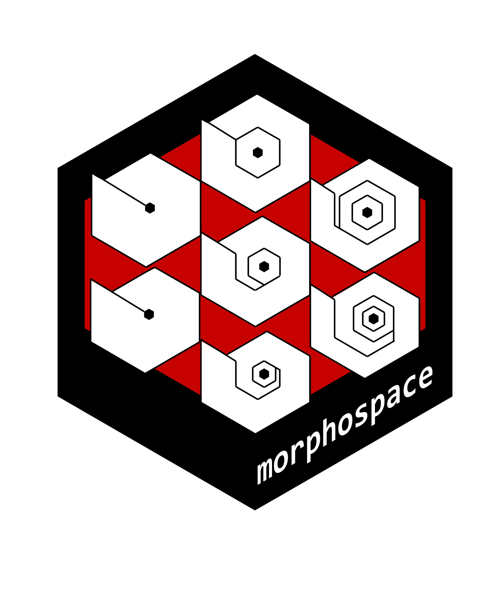

<!-- README.md is generated from README.Rmd. Please edit that file -->

```{r setup, include=FALSE}
knitr::opts_chunk$set(
  collapse = TRUE,
  comment = "#>",
  fig.path = "man/figures/README-",
  out.width = "100%",
  dpi = 400
)
```

# morphospace 

<!-- badges: start -->
[](https://github.com/millacarmona/morphospace/actions/workflows/R-CMD-check.yaml)
<!-- badges: end -->

The goal of `morphospace` is to enhance representation and heuristic exploration of multivariate ordinations of shape data. This package can handle the most common types of shape data working in integration with other widely used R packages such as `Morpho` (Schlager 2017), `geomorph` (Adams et al. 2021), `shapes` (Dryden 2019), and `Momocs` (Bonhome et al. 2014), which cover other more essential steps in the geometric morphometrics pipeline (e.g. importation, normalization, statistical analysis).


## Installation


You can install the development version of morphospace from [GitHub](https://github.com/) with:

``` r
# install.packages("devtools")
devtools::install_github("millacarmona/morphospace")
```

## Concept

The basic idea behind `morphospace` is to build empirical morphospaces using multivariate ordination methods, then use the resulting ordination as a reference in which elements representing different aspects of morphometric variation are projected. These elements are added to both graphic representations and objects as consecutive 'layers' and list slots, respectively, using the `%>%` pipe operator from `magrittr` (Bache & Wickham 2022).

The starting point of the `morphospace` workflow is a set of shapes (i.e. morphometric data that is already free of variation due to differences in orientation, position and scale). These are feeeded to the `mspace` function, which generates a morphospace using a variety of multivariate methods related to Principal Component Analysis. This general workflow is outlined below using the `tails` data set from Fasanelli et al. (2022), which contains tail shapes from 281 specimens belonging to 13 species of the genus *Tyrannus*.


```{r, message = FALSE}
library(morphospace)
library(geomorph)
library(magrittr)
```


```{r}
# Load tail data
data("tails")

shapes <- tails$shapes
spp <- tails$data$species
wf <- tails$links
phy <- tails$tree

# Generate morphospace
mspace(shapes, links = wf, cex.ldm = 5)
```


The ordination produced by `mspace` is used as a reference frame in which scatter points, groups centroids, convex hulls, a phylogeny or a set of morphometric axes can be projected using the `proj_*` functions:


```{r}
# Get mean shapes of each species
spp_shapes <- consensus(shapes = tails$shapes, index = tails$data$species)

# Generate morphospace and project:
msp <- mspace(shapes = shapes, links = wf, cex.ldm = 5) %>% 
  # scatter points
  proj_shapes(shapes = shapes, col = spp) %>% 
  # groups centroids (mean shapes)
  proj_consensus(shapes = spp_shapes, bg = 1:nlevels(spp), pch = 21) %>% 
  # convex hulls enclosing groups
  proj_groups(groups = spp) %>% 
  # phylogenetic relationships
  proj_phylogeny(tree = phy, lwd = 1.5) 

```


Once the `"mspace"` object is in place, the `plot_mspace` function can be used to either regenerate/modify the plot or to combine morphometric axes with other, non-shape variables to produce 'hybrid' morphospaces. For example, PC1 can be plotted against size to explore allometric patterns (the standard `graphics` tools work here, so we manipulate the margins a bit to add a legend).


```{r}
# Plot PC1 against log-size, add legend
par(mar = c(5.1, 4.1, 4.1, 6), xpd = TRUE)

plot_mspace(msp, x = tails$sizes, axes = 1, nh = 6, nv = 6, cex.ldm = 4, 
            col.points = spp, col.groups = 1:nlevels(spp), xlab = "Log-size", 
            groups = TRUE)
legend("topright", inset = c(-0.22, 0), legend = levels(spp), 
       cex = 0.7, pch = 16, col = 1:nlevels(spp), bty = "n", text.font = 3)
```


Ordination axes can be also combined with a phylogenetic tree to create a phenogram:


```{r}
# Plot vertical phenogram using PC2, add a legend
par(mar = c(5.1, 4.1, 4.1, 6), xpd = TRUE)

plot_mspace(msp, y = phy, axes = 2, nh = 6, nv = 6, cex.ldm = 4, 
            col.groups = 1:nlevels(spp), ylab = "Time")
legend("topright", inset = c(-0.22, 0), legend = levels(spp), 
       cex = 0.7, pch = 16, col = 1:nlevels(spp), bty = "n", text.font = 3)
```


`morphospace` can handle elliptic Fourier coefficients and 3D landmark data, perform some useful shape operations, and use TPS interpolation of curves/meshes to improve visualizations. It also supports a variety of multivariate methods (bgPCA, phylogenetic PCA, PLS, phylogenetic PLS) to produce ordinations. For these and other options and details, go to [General usage](https://millacarmona.github.io/morphospace/articles/General-usage.html) and [Worked examples](https://millacarmona.github.io/morphospace/articles/Worked-examples.html).


## References


Adams D.C., Collyer M.L., Kaliontzopoulou A., & Baken E.K. (2021). *geomorph: Software for geometric morphometric analyses*. R package version 4.0.2. <https://cran.r-project.org/package=geomorph>.

Bache S.F., & Wickham H. (2022). m*agrittr: A Forward-Pipe Operator for R*. R package version 2.0.3. <https://CRAN.R-project.org/package=magrittr>.

Bonhomme V., Picq S., Gaucherel C., & Claude J. (2014). *Momocs: Outline Analysis Using R*. Journal of Statistical Software, 56(13), 1-24.  <http://www.jstatsoft.org/v56/i13/>.

Dryden, I.L. (2019). *shapes: statistical shape analysis*. R package version 1.2.5. <https://CRAN.R-project.org/package=shapes>.

Fasanelli M.N., Milla Carmona P.S., Soto I.M., & Tuero, D.T. (2022). *Allometry, sexual selection and evolutionary lines of least resistance shaped the evolution of exaggerated sexual traits within the genus* Tyrannus. Journal of Evolutionary Biology, in press. <https://doi.org/10.1111/jeb.14000>.

Schlager S. (2017). *Morpho and Rvcg - Shape Analysis in R*. In Zheng G., Li S., Szekely G. (eds.), *Statistical Shape and Deformation Analysis*, 217-256. Academic Press. <https://doi.org/10.1016/B978-0-12-810493-4.00011-0>.
