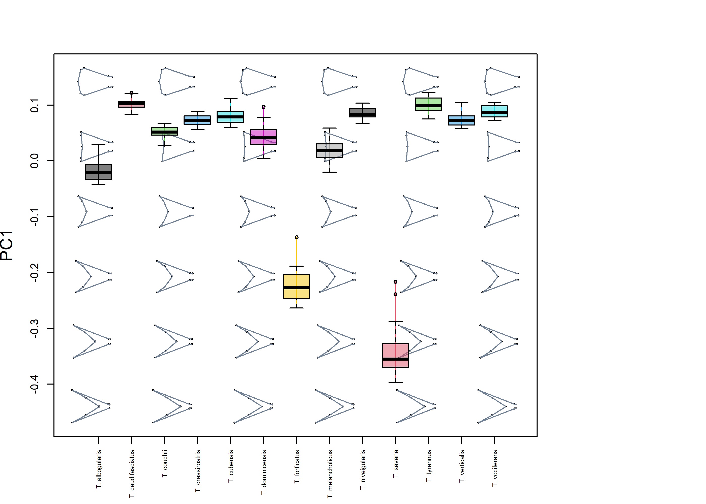

<!-- README.md is generated from README.Rmd. Please edit that file -->

# morphospace

<!-- badges: start -->
<!-- badges: end -->

A package for people who can’t visualize morphospaces good and wanna
learn to do other geometric morphometrics stuff good too.

## Installation

You can install the development version of morphospace from
[GitHub](https://github.com/) with:

``` r
# install.packages("devtools")
devtools::install_github("millacarmona/morphospace")
```

## Purpose

This package is intended to aid exploration and depiction of
multivariate ordinations of shape data obtained through geometric
morphometrics analyses. The functions from `morphospace` have been
designed to work in intergration with other widely used geometric
morphometrics R packages such as `Morpho` (Schlager 2017), `geomorph`
(Adams et al. 2021), and `Momocs` (Bonhome et al. 2014), whose functions
cover other more essential steps in geometric morphometrics analysis
(e.g. import, normalization, and statistical analysis).

Below, the general concept and capabilities of `morphospace` are
displayed using two data sets representing different types of geometric
morphometric data. The first data set, taken from from Fasanelli et
al. (2022), contains a sample of tail shapes from the 13 species of the
genus *Tyrannus*, two of which (*T. savana* and *T. forficatus*) display
exaggeratedly elongated tails, as well as a considerable allometric
variation and sexual dimorphism in tail shape. The `tails` data set
contains landmark data and centroid sizes from the tails of 281
specimens, their classification to species and sex, and the phylogenetic
relationships between *Tyrannus* species (see Fasanelli et al. 2022 and
references therein). Also included are the links between landmarks to
aid visualization of landmark configurations.

``` r
library(morphospace)
library(geomorph)
#> Loading required package: RRPP
#> Loading required package: rgl
#> Loading required package: Matrix

# Load tail data and extract shapes, centroid sizes, classification of sex and species,
# links between landmarks, and phylogenetic tree

data("tails")
shapes <- tails$shapes
species <- tails$data$species
sizes <- log(tails$sizes)
sex <- tails$data$sex
links <- tails$links
tree <- tails$tree
```

Morphometric variation is assumed to be already free of differences of
orientation, position and scale. This standardization can be readily
performed using functions from the aforementioned R packages.

``` r
# Inspect shapes
pile_shapes(shapes, links = links)
```


## Shape operations

This package provide some functions that perform basic operations with
shape variables, such as the calculation of mean shapes or the
analytical removal of undesired sources of variation.

``` r
# Remove variation associated to sexual dimorphism and compute the consensus shape
# of each species
cons_shapes <- consensus(shapes = shapes, index = species)
detr_shapes <- arrayspecs(detrend_shapes(model = lm(two.d.array(shapes) ~ sex)),
                          p = nrow(shapes), k = ncol(shapes))
detr_cons_shapes <- consensus(shapes = detr_shapes, index = species)
```

## Workflow

The basic idea behind the `morphospace` workflow is to build (empiric)
morphospaces using multivariate methods (PCA and the like), then use the
resulting synthesis as a reference in which to project different
elements. These elements are added both to the plot and the `"mspace"`
object as succesive ‘layers’ or list slots, respectively, using the
`%>%` pipe operator from `magrittr` (Bache & Wickham 2022).

Another potentially interesting element that can be projected and
visualized in morphospaces are morphometric axes, i.e. synthetic axes
built as linear combinations of shape variables. For example, we can
project the first two PC axes resulting from the PCA of our shape data
into our morphospace (yes, this is redundant).

``` r
# perform PCA of refined shape variables, create morphospace, and project the first 2 
# axes from the former into  the latter
pca <- prcomp(two.d.array(detr_shapes))
mspace(detr_shapes, links = links, mag = 0.7, axes = c(1,2)) %>%
  proj_shapes(shapes = detr_shapes, col = species) %>%
  proj_groups(shapes = detr_shapes, groups = species) %>%
  proj_consensus(shapes = detr_cons_shapes, pch = 21, bg = 1:13, cex = 1.2) %>%
  proj_phylogeny(tree = tree, pch = 16) %>%
  proj_axes(neword = pca, ax = c(1,2), col = "black", lwd = 2, lty = 2)
```



## Ordination methods

The default settings of `mspace` rely on the `prcomp` function from base
R to perform the PCA that builds the synthetic morphometric space.
However, `morphospace` also includes a couple of supervised ordination
alternatives, namely phylogenetic PCA (Revell 2009; borrowed from
`phytools`, Revell 2012) between-groups PCA and Partial Least Squares
(PLS). These have been styled so they share format with `prcomp`, and
the latter two allow performing a leave-one-out cross-validation that
alleviates some spurious results that can arise when the number of
variables exceeds the number of samples (as it is common in geometric
morphometric analyses; see Cardini et al. 2019 and Cardini & Polly
2020).

``` r
# Simulate 100 random normal distributions, and add an artificial classification and
# and artificial covariate
random_y <- do.call("cbind", lapply(1:100, function(i) {rnorm(90)}))
class <- factor(rep(c("A", "B", "C"), each = 30))
random_x <- rnorm(90)

# Perform bgPCA on the set of random variables to look for the bgPCs maximizing separation
# between artificial groups, with and without LOOCV
layout(cbind(1,2))
bgpca1 <- bg_prcomp(x =random_y, groups = class)
plot(bgpca1$x, col = c(1:3)[class])
hulls_by_group_2D(bgpca1$x, class)
title("without LOOCV")

bgpca2 <- bg_prcomp(x = random_y, groups = class, LOOCV = TRUE)
plot(bgpca2$x, col = c(1:3)[class])
hulls_by_group_2D(bgpca2$x, class)
title("with LOOCV")
```


``` r
# Perform PLS on the set of random variables to look for the PLS axis maximzing covariation
# between them and the artificial covariate, with and without LOOCV
layout(cbind(1,2))
pls1 <- pls2b(x = random_x, y = random_y)
plot(pls1$xscores, pls1$yscores)
abline(lm(pls1$yscores ~ pls1$xscores), col = "red")
title("without LOOCV")

pls2 <- pls2b(x = random_x, y = random_y, LOOCV = TRUE)
plot(pls2$xscores, pls2$yscores)
abline(lm(pls2$yscores ~ pls2$xscores), col = "red")
title("with LOOCV")
```


``` r
dev.off()
#> null device 
#>           1
```

These methods can be used instead of regular PCA for morphospace
construction via the `FUN` and `...` arguments (adding the argument
`groups` for `bg_prcomp` and `tree` for `phy_prcomp`) of `mspace`. The
resulting morphospace can be combined with the rest of the functions in
the same way as before:

``` r
# Phylogenetic PCA for all species
mspace(detr_cons_shapes, FUN = phy_prcomp, tree = tree, links = links,
       mag = 0.7, axes = c(1,2), xlim = c(-0.35, 0.15), ylim = c(-0.25, 0.1)) %>%
  proj_consensus(shapes = detr_cons_shapes, bg = 1:13, pch = 21) %>%
  proj_phylogeny(tree = tree, pch = 16)
```


``` r
# Phylogenetic PCA for all species, adding projection of intrapspecific variation
mspace(detr_cons_shapes, FUN = phy_prcomp, tree = tree, links = links,
       mag = 0.7, axes = c(1,2), xlim = c(-0.35, 0.15), ylim = c(-0.25, 0.1)) %>%
  proj_shapes(shapes = detr_shapes, col = species) %>%
  proj_groups(shapes = detr_shapes, groups = species) %>%
  proj_consensus(shapes = detr_cons_shapes, col = "black", pch = 16) %>%
  proj_phylogeny(tree = tree, pch = 16)
```


``` r
# Between group PCA - all species
mspace(shapes, FUN = bg_prcomp, LOOCV = TRUE, groups = species,
       links = links, mag = 0.7, axes = c(1,2)) %>%
  proj_shapes(shapes = shapes, col = species) %>%
  proj_groups(shapes = shapes, groups = species)
```


The rationale of defining a reference ordination using a given sample of
shapes and then projecting other elements into it (computed from either
the same or a different but compatible sample of shapes) can be used to
sequentially construct rather complex graphics.

For example, suppose we are interested in the patterns of interspecific
variation, but we don’t want the marked divergence of deep forked (DF)
species to influence the axes because we don’t want the non-deep forked
(NDF) species to be crushed and collapsed in the same tiny region of the
morphospace. We could subset our shapes to retain only NDF species,
build an ordination using a bgPCA between them (so our axes maximize the
interspecific variation between NDF species), and then project the
samples corresponding to DF species into the resulting morphospace.

``` r
# Between group PCA - only non-deepforked species, then project deep forked species
# (so the ordination better reflects evolution of species with "ordinary" tails)
detr_shapes_ndf <- detr_shapes[,,tails$data$type == "NDF"]
species_ndf <- factor(species[tails$data$type == "NDF"])
sizes_ndf <- sizes[tails$data$type == "NDF"]

morphospace <- mspace(detr_shapes_ndf, FUN = bg_prcomp, groups = species_ndf,
                      links = links, mag = 0.7, axes = c(1,2),
                      xlim = c(-0.1, 0.4), ylim = c(-0.1, 0.1)) %>%
  proj_consensus(shapes = cons_shapes, col = 1:13, pch = 16) %>%
  proj_shapes(shapes = shapes, col = species) %>%
  proj_groups(shapes = shapes, groups = species)
```


Finally, let’s say we want to project the axis representing the
allometric variation (e.g. a PLS of shape vs centroid size) of each
species, so we can see whether these are aligned with the axes
maximizing NDF interspecific variation. Suppose we also want to project
the phylogenetic relationships into our morphospace so we can say we
have a phylomorphospace (Sidlauskas 2008). The following chunk of code
illustrates how to combine the pipe workflow described above with
`proj_*` functions called outside the pipe.

``` r
# Between group PCA - only non-deepforked species, then project deep forked species
# (so the ordination better reflects evolution of species with "ordinary" tails)
morphospace <- mspace(detr_shapes_ndf, FUN = bg_prcomp, groups = species_ndf,
                      links = links, mag = 0.7, axes = c(1,2),
                      xlim = c(-0.1, 0.4), ylim = c(-0.1, 0.1)) %>%
  proj_consensus(shapes = cons_shapes, col = 1:13, pch = 16) %>%
  proj_shapes(shapes = shapes, col = species) %>%
  proj_groups(shapes = shapes, groups = species)
# Add allometric axis (i.e., the PLS axis maximizing correlation between shape and
# size) calculated separatedly for each species
for(i in 1:nlevels(species)){
  index <- species==levels(species)[i]
  subshapes <- detr_shapes[,,index]
  subsizes <- sizes[index]
  pls <- pls_shapes(shapes = subshapes, x = subsizes)
  proj_axes(neword = pls, morphospace, ax = 1, pipe = FALSE, col = "red", lwd = 2)
}
# Add species' mean shapes and phylogeny
proj_consensus(mspace = morphospace, shapes = consensus(detr_shapes, species), pch = 16, pipe = FALSE)
#>                           [,1]         [,2]          [,3]          [,4]
#> T. albogularis     0.089046912  0.022509712 -0.0005135166 -3.344071e-03
#> T. caudifasciatus -0.047083450  0.015972993 -0.0075991791 -1.077584e-02
#> T. couchii         0.008340754  0.018868869 -0.0133488762  5.257035e-03
#> T. crassirostris  -0.014940452  0.031437733 -0.0213574762  7.433054e-03
#> T. cubensis       -0.017266607  0.009919055  0.0015425683 -9.178248e-03
#> T. dominicensis    0.032619665  0.033302881  0.0274486123  1.559447e-03
#> T. forficatus      0.332600244  0.013980771 -0.0030047297  6.273431e-02
#> T. melancholicus   0.045589411 -0.032688287 -0.0096946654 -1.558982e-03
#> T. niveigularis   -0.025722792 -0.014591594  0.0182683269 -1.850043e-03
#> T. savana          0.319453207 -0.031067786 -0.1108283271 -2.990565e-02
#> T. tyrannus       -0.046621656 -0.004046648 -0.0030478799 -8.327575e-05
#> T. verticalis     -0.011485582 -0.021319442  0.0071078565  2.154253e-03
#> T. vociferans     -0.029634465 -0.017924912  0.0093960700  8.601730e-03
#>                            [,5]          [,6]          [,7]          [,8]
#> T. albogularis     0.0105024213  0.0003580610 -1.720632e-04 -1.876000e-11
#> T. caudifasciatus -0.0014361362  0.0007038034 -8.366542e-04  7.750889e-12
#> T. couchii         0.0001907758 -0.0011601452 -5.088144e-04  6.309637e-11
#> T. crassirostris  -0.0010926952  0.0003599824  1.262251e-04 -3.026839e-11
#> T. cubensis       -0.0015647490  0.0039643980  1.091202e-03 -1.942162e-13
#> T. dominicensis   -0.0068673166 -0.0006710283  2.366145e-04  4.898872e-13
#> T. forficatus     -0.0281434684 -0.0094282592 -1.217295e-02 -8.303949e-10
#> T. melancholicus  -0.0034171919 -0.0001311641  2.579053e-04  4.182492e-12
#> T. niveigularis    0.0056910645 -0.0016465718 -1.072527e-05  1.662893e-11
#> T. savana          0.2331766936  0.0438724709  1.833530e-02 -6.481488e-09
#> T. tyrannus        0.0017859289 -0.0026816308  9.320437e-04 -1.248288e-11
#> T. verticalis     -0.0017586954 -0.0004386480 -1.322180e-03 -3.412516e-11
#> T. vociferans      0.0029680090  0.0036933532  1.031440e-04  1.121403e-11
#>                            [,9]         [,10]         [,11]         [,12]
#> T. albogularis    -3.198096e-12  4.826269e-11  7.939334e-11  1.045998e-11
#> T. caudifasciatus  7.872204e-12 -9.849953e-12 -1.561093e-11 -4.549529e-12
#> T. couchii         2.390874e-11 -1.630557e-10 -2.482767e-10 -3.583927e-11
#> T. crassirostris  -1.911808e-11  7.387402e-11  1.046144e-10  1.753009e-11
#> T. cubensis       -8.482743e-12 -1.721383e-11 -2.488089e-11  3.572316e-13
#> T. dominicensis    2.423073e-12  2.264868e-12  4.007391e-12 -3.552796e-13
#> T. forficatus     -1.213196e-09  6.701056e-09  8.909882e-09  1.175390e-09
#> T. melancholicus   1.364091e-12 -7.904619e-12 -1.460064e-11 -2.336950e-12
#> T. niveigularis   -5.608400e-12 -4.482891e-11 -8.430269e-11 -8.872987e-12
#> T. savana         -5.109429e-10  1.175661e-08  2.058716e-08  3.373129e-09
#> T. tyrannus        2.029846e-12  3.286940e-11  5.949680e-11  6.761253e-12
#> T. verticalis     -1.431622e-11  7.591303e-11  1.230269e-10  1.933450e-11
#> T. vociferans      1.069509e-11 -2.003194e-11 -2.794690e-11 -6.603317e-12
#>                           [,13]         [,14]         [,15]         [,16]
#> T. albogularis    -1.150611e-11 -4.818436e-11 -1.566898e-11  5.699261e-11
#> T. caudifasciatus  8.417618e-12 -1.914710e-13  8.111368e-13  1.927658e-12
#> T. couchii         4.824595e-11  1.321489e-10  5.705533e-11 -1.671221e-10
#> T. crassirostris  -2.819815e-11 -4.362532e-11 -2.632826e-11  5.984313e-11
#> T. cubensis       -4.354314e-12  2.776357e-11  1.066164e-11 -3.821897e-11
#> T. dominicensis    1.617052e-12 -5.880819e-12 -1.554505e-12  7.510393e-12
#> T. forficatus     -7.276297e-10 -5.278228e-09 -3.086419e-09  1.023294e-08
#> T. melancholicus   2.735959e-12  7.823380e-12  1.542677e-12 -7.828273e-12
#> T. niveigularis    4.333388e-12  6.316518e-11  1.297969e-11 -6.947628e-11
#> T. savana         -4.505104e-09 -1.079800e-08 -3.274695e-09  1.081116e-08
#> T. tyrannus       -4.741222e-12 -4.200847e-11 -9.788564e-12  4.693779e-11
#> T. verticalis     -2.580968e-11 -6.217638e-11 -2.206374e-11  7.215671e-11
#> T. vociferans      1.228201e-11  4.197579e-12  5.303191e-12 -5.878136e-12
#>                           [,17]         [,18]
#> T. albogularis     1.450419e-12  1.104524e-11
#> T. caudifasciatus  1.119950e-11 -1.849932e-11
#> T. couchii         1.718000e-11 -4.276977e-11
#> T. crassirostris  -2.143987e-11  2.886927e-11
#> T. cubensis       -1.556853e-11  2.309462e-11
#> T. dominicensis    4.169763e-12 -5.182075e-12
#> T. forficatus      5.456239e-09 -7.850122e-10
#> T. melancholicus   9.931680e-13 -5.821082e-12
#> T. niveigularis   -1.564141e-11 -3.499798e-12
#> T. savana         -6.859671e-09  5.460195e-09
#> T. tyrannus        8.014903e-12  4.521302e-12
#> T. verticalis     -1.257459e-11  3.688096e-11
#> T. vociferans      1.458670e-11 -2.026923e-11
proj_phylogeny(mspace = morphospace, tree = tree, pch = 16, pipe = FALSE)
```


    #>                        [,1]        [,2]      [,3]       [,4]      [,5]
    #> T. melancholicus  0.3269662 -0.08996052 0.3269662 0.08996056 0.2659204
    #> T. cubensis       0.3233763 -0.10872211 0.3233763 0.10872215 0.2559019
    #> T. dominicensis   0.3142908 -0.09977759 0.3142908 0.09977763 0.2510244
    #> T. albogularis    0.3142823 -0.09368892 0.3142823 0.09368895 0.2512193
    #> T. forficatus     0.2999117 -0.05865798 0.2999117 0.05865801 0.2609288
    #> T. verticalis     0.3275116 -0.09605396 0.3275115 0.09605400 0.2654676
    #> T. vociferans     0.3275173 -0.10093565 0.3275173 0.10093569 0.2669199
    #> T. tyrannus       0.3318192 -0.10766325 0.3318192 0.10766328 0.2591619
    #> T. crassirostris  0.3271603 -0.11957017 0.3271603 0.11957021 0.2508614
    #> T. couchii        0.3256609 -0.10936556 0.3256609 0.10936560 0.2538548
    #> T. niveigularis   0.3265585 -0.09535092 0.3265585 0.09535096 0.2630953
    #> T. caudifasciatus 0.3276803 -0.11501430 0.3276803 0.11501434 0.2536604
    #> T. savana         0.3082387 -0.06439947 0.3082387 0.06439950 0.2661930
    #> 14                0.3200574 -0.09311298 0.3200574 0.09311301 0.2593875
    #> 15                0.3216004 -0.09686156 0.3216004 0.09686160 0.2584991
    #> 16                0.3198307 -0.09696104 0.3198306 0.09696107 0.2564515
    #> 17                0.3210676 -0.09825031 0.3210676 0.09825035 0.2574325
    #> 18                0.3204726 -0.09984827 0.3204725 0.09984831 0.2563753
    #> 19                0.3227270 -0.09880613 0.3227269 0.09880616 0.2584028
    #> 20                0.3231580 -0.09974184 0.3231580 0.09974188 0.2583102
    #> 21                0.3231375 -0.09555740 0.3231374 0.09555743 0.2611518
    #> 22                0.3211563 -0.09123183 0.3211563 0.09123187 0.2626729
    #> 23                0.3193625 -0.08788830 0.3193624 0.08788833 0.2627995
    #> 24                0.3250002 -0.10808214 0.3250002 0.10808218 0.2549391
    #> 25                0.3233466 -0.09970562 0.3233466 0.09970565 0.2583993
    #>                          [,6]      [,7]       [,8]       [,9]      [,10]
    #> T. melancholicus  -0.09605852 0.2659204 0.09605855 -0.2361291 -0.3274506
    #> T. cubensis       -0.11744202 0.2559019 0.11744204 -0.2131067 -0.3259956
    #> T. dominicensis   -0.10924053 0.2510244 0.10924056 -0.2196870 -0.3322337
    #> T. albogularis    -0.10511578 0.2512193 0.10511581 -0.2442626 -0.3429733
    #> T. forficatus     -0.06579891 0.2609288 0.06579894 -0.3050733 -0.3456461
    #> T. verticalis     -0.10534442 0.2654675 0.10534445 -0.2189986 -0.3173407
    #> T. vociferans     -0.10773460 0.2669199 0.10773463 -0.2169360 -0.3112567
    #> T. tyrannus       -0.12045246 0.2591618 0.12045249 -0.2123582 -0.3129186
    #> T. crassirostris  -0.13316313 0.2508614 0.13316316 -0.2206871 -0.3165629
    #> T. couchii        -0.12252987 0.2538548 0.12252990 -0.2269917 -0.3211370
    #> T. niveigularis   -0.10630318 0.2630953 0.10630321 -0.2150507 -0.3186152
    #> T. caudifasciatus -0.12927816 0.2536604 0.12927819 -0.2075709 -0.3209104
    #> T. savana         -0.07096724 0.2661930 0.07096727 -0.4217377 -0.3924880
    #> 14                -0.10311233 0.2593875 0.10311236 -0.2705406 -0.3399082
    #> 15                -0.10730891 0.2584990 0.10730894 -0.2508017 -0.3330439
    #> 16                -0.10663112 0.2564515 0.10663115 -0.2377641 -0.3336640
    #> 17                -0.10687372 0.2574325 0.10687375 -0.2289158 -0.3304383
    #> 18                -0.10859634 0.2563753 0.10859636 -0.2255814 -0.3300858
    #> 19                -0.10962803 0.2584028 0.10962806 -0.2428165 -0.3293385
    #> 20                -0.11065526 0.2583102 0.11065529 -0.2398202 -0.3271461
    #> 21                -0.10550806 0.2611518 0.10550809 -0.2363843 -0.3227974
    #> 22                -0.10017516 0.2626729 0.10017519 -0.2405532 -0.3234073
    #> 23                -0.09665630 0.2627995 0.09665633 -0.2457297 -0.3253557
    #> 24                -0.12039178 0.2549391 0.12039181 -0.2307692 -0.3224475
    #> 25                -0.11077948 0.2583992 0.11077951 -0.2383722 -0.3279877
    #>                        [,11]      [,12]       [,13]         [,14]      [,15]
    #> T. melancholicus  -0.2512369 -0.2399036 -0.21104107 -1.172654e-08 -0.2512370
    #> T. cubensis       -0.2370100 -0.2577847 -0.25832286 -1.477394e-08 -0.2370101
    #> T. dominicensis   -0.2384688 -0.2827381 -0.21431865 -1.202562e-08 -0.2384689
    #> T. albogularis    -0.2360959 -0.2679184 -0.17028608 -9.429709e-09 -0.2360959
    #> T. forficatus     -0.2802143 -0.2889284  0.04889429 -8.045530e-09 -0.2802143
    #> T. verticalis     -0.2444811 -0.2508515 -0.25899882 -1.463598e-08 -0.2444811
    #> T. vociferans     -0.2403637 -0.2542662 -0.27427478 -1.562415e-08 -0.2403637
    #> T. tyrannus       -0.2372985 -0.2507516 -0.28264856 -1.631861e-08 -0.2372986
    #> T. crassirostris  -0.2354704 -0.2596599 -0.24372829 -1.381387e-08 -0.2354704
    #> T. couchii        -0.2380378 -0.2580460 -0.22897238 -1.279587e-08 -0.2380379
    #> T. niveigularis   -0.2375988 -0.2569933 -0.27400856 -1.562237e-08 -0.2375988
    #> T. caudifasciatus -0.2343703 -0.2537136 -0.27879891 -1.611312e-08 -0.2343704
    #> T. savana         -0.1409148 -0.1916782 -0.02355842 -2.417078e-08 -0.1409148
    #> 14                -0.2171962 -0.2434925 -0.18341613 -1.609967e-08 -0.2171962
    #> 15                -0.2271548 -0.2502569 -0.20428575 -1.504598e-08 -0.2271549
    #> 16                -0.2359200 -0.2584628 -0.20519607 -1.267578e-08 -0.2359200
    #> 17                -0.2401456 -0.2588964 -0.21887735 -1.274577e-08 -0.2401456
    #> 18                -0.2395047 -0.2619235 -0.22352335 -1.291996e-08 -0.2395047
    #> 19                -0.2307894 -0.2523200 -0.21504756 -1.492133e-08 -0.2307895
    #> 20                -0.2336075 -0.2539061 -0.21608112 -1.464585e-08 -0.2336075
    #> 21                -0.2432563 -0.2576219 -0.20929724 -1.426070e-08 -0.2432563
    #> 22                -0.2482397 -0.2605811 -0.19007269 -1.364807e-08 -0.2482397
    #> 23                -0.2516391 -0.2628242 -0.16958613 -1.309210e-08 -0.2516392
    #> 24                -0.2353896 -0.2567078 -0.22756089 -1.388637e-08 -0.2353896
    #> 25                -0.2315223 -0.2527479 -0.22370269 -1.505483e-08 -0.2315223
    #>                       [,16]      [,17]     [,18]
    #> T. melancholicus  0.2399036 -0.2361292 0.3274505
    #> T. cubensis       0.2577847 -0.2131068 0.3259956
    #> T. dominicensis   0.2827381 -0.2196870 0.3322337
    #> T. albogularis    0.2679184 -0.2442626 0.3429732
    #> T. forficatus     0.2889283 -0.3050733 0.3456461
    #> T. verticalis     0.2508515 -0.2189986 0.3173407
    #> T. vociferans     0.2542662 -0.2169361 0.3112567
    #> T. tyrannus       0.2507516 -0.2123582 0.3129186
    #> T. crassirostris  0.2596599 -0.2206871 0.3165629
    #> T. couchii        0.2580460 -0.2269917 0.3211370
    #> T. niveigularis   0.2569933 -0.2150507 0.3186151
    #> T. caudifasciatus 0.2537136 -0.2075709 0.3209103
    #> T. savana         0.1916782 -0.4217377 0.3924880
    #> 14                0.2434925 -0.2705407 0.3399082
    #> 15                0.2502569 -0.2508017 0.3330439
    #> 16                0.2584628 -0.2377642 0.3336640
    #> 17                0.2588964 -0.2289158 0.3304383
    #> 18                0.2619234 -0.2255814 0.3300857
    #> 19                0.2523200 -0.2428165 0.3293385
    #> 20                0.2539061 -0.2398202 0.3271461
    #> 21                0.2576219 -0.2363843 0.3227974
    #> 22                0.2605811 -0.2405532 0.3234073
    #> 23                0.2628241 -0.2457297 0.3253557
    #> 24                0.2567078 -0.2307692 0.3224474
    #> 25                0.2527479 -0.2383722 0.3279877

## Flexible visualization

The `mspace` objects created using the `mspace` and `proj_*` functions
in pipeline can be plotted with `plot_mspace`, which adds further
flexibility to the whole depiction thing. By plottinh a `mspace` object
using this function we can select a different set of axes to plot,
colors and symbols for points, groups, etc.

``` r
# Generate a mspace object, then erase the plot
morphospace <- mspace(detr_shapes, links = links, mag = 0.7, axes = c(1,2))  %>%
  proj_shapes(shapes = detr_shapes, col = species) %>%
  proj_groups(shapes = detr_shapes, groups = species) %>%
  proj_consensus(shapes = detr_cons_shapes, pch = 21, bg = 1:13, cex = 1.2) %>%
  proj_phylogeny(tree = tree, pch = 16)
```


``` r

# The funcion plot_mspace can take an object created with mspace + projections
# and plot it.
plot_mspace(mspace = morphospace, points = TRUE, mshapes = FALSE, groups = FALSE, phylo = FALSE)
```


``` r

# The elements added through mspace pipes can be added using the corresponding arguments
plot_mspace(mspace = morphospace, axes = c(1,2), groups = TRUE, points = TRUE,
            col.points = species, col.groups = 1:nlevels(species),
            mshapes = FALSE, phylo = FALSE)
```


``` r
# The function allows modification different aspects of the plot, such as the axes
# to be plotted, the number of shape models in the background or the size of their landmarks
plot_mspace(mspace = morphospace, axes = c(1,3), nh = 3, groups = TRUE, points = TRUE,
            col.points = species, col.groups = 1:nlevels(species), cex.ldm = 0,
            mshapes = FALSE, phylo = FALSE)
```


In addition, `plot_mspace` allows specification of an external,
non-shape variable (or, alternatively, a phylogenetic tree) to be
combined with the axes of our morphospace to create ‘hybrid’
morphospaces. For example, if we provide a phylogenetic tree for the `x`
argument of `plot_mspace`, we get a phenogram:

``` r
# A phylogenetic tree can be included to produce a phenogram
phylomorphospace <- mspace(cons_shapes, links = links, mag = 0.7, axes = c(1,2), cex.ldm = 0, asp.models = 2, size.models = 0.5)  %>%
  proj_consensus(shapes = cons_shapes, pch = 21, bg = 1:13, cex = 1.2) %>%
  proj_phylogeny(tree = tree, pch = 16)
```


``` r
plot_mspace(phylomorphospace, x = tree, axes = 1, asp.models = 0.7, size.models = 3, col.groups = 1:13)
```


## Closed outlines

## References

Adams D.C., Collyer M.L., Kaliontzopoulou A., & Baken E.K. (2021).
geomorph: Software for geometric morphometric analyses. R package
version 4.0.2. <https://cran.r-project.org/package=geomorph>.

Bache S.F., & Wickham H. (2022). magrittr: A Forward-Pipe Operator for
R. R package version 2.0.3.
<https://CRAN.R-project.org/package=magrittr>.

Bonhomme V., Picq S., Gaucherel C., & Claude J. (2014). Momocs: Outline
Analysis Using R. Journal of Statistical Software, 56(13), 1-24.
<http://www.jstatsoft.org/v56/i13/>.

Cardini A., O’Higgins P., & Rohlf F.J. (2019). Seeing distinct groups
where there are none: spurious patterns from between-group PCA.
Evolutionary Biology, 46(4), 303-316.
<https://doi.org/10.1007/s11692-019-09487-5>.

Cardini A., & Polly P. D. (2020). Cross-validated between group PCA
scatterplots: A solution to spurious group separation?. Evolutionary
Biology, 47(1), 85-95. <https://doi.org/10.1007/s11692-020-09494-x>.

Fasanelli M.N., Milla Carmona P.S., Soto I.M., & Tuero, D.T. (2022).
Allometry, sexual selection and evolutionary lines of least resistance
shaped the evolution of exaggerated sexual traits within the genus
*Tyrannus*. Journal of Evolutionary Biology, in press.
<https://doi.org/10.1111/jeb.14000>.

Revell, L.J. (2009). Size-correction and principal components for
interspecific comparative studies. Evolution, 63, 3258-3268.
<https://doi.org/10.1111/j.1558-5646.2009.00804.x>

Revell, L.J. (2012). phytools: An R package for phylogenetic comparative
biology (and other things). Methods in Ecology and Evolution 3, 217-223.
<https://doi.org/10.1111/j.2041-210X.2011.00169.x>.

Schlager S. (2017). Morpho and Rvcg - Shape Analysis in R. In Zheng G.,
Li S., Szekely G. (eds.), Statistical Shape and Deformation Analysis,
217-256. Academic Press.
<https://doi.org/10.1016/B978-0-12-810493-4.00011-0>.

Sidlauskas, B. (2008). Continuous and arrested morphological
diversification in sister clades of characiform fishes: a
phylomorphospace approach. Evolution: International Journal of Organic
Evolution, 62(12), 3135-3156.
<https://doi.org/10.1111/j.1558-5646.2008.00519.x>.

You’ll still need to render `README.Rmd` regularly, to keep `README.md`
up-to-date. `devtools::build_readme()` is handy for this. You could also
use GitHub Actions to re-render `README.Rmd` every time you push. An
example workflow can be found here:
<https://github.com/r-lib/actions/tree/v1/examples>.

You can also embed plots, for example:

In that case, don’t forget to commit and push the resulting figure
files, so they display on GitHub and CRAN.
