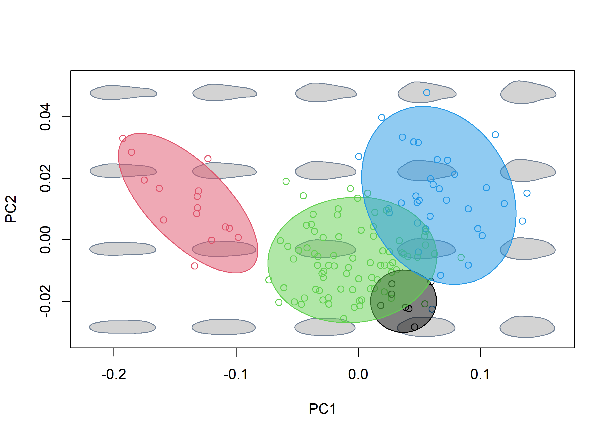

<!-- README.md is generated from README.Rmd. Please edit that file -->

# morphospace

<!-- badges: start -->
<!-- badges: end -->

A package for people who can’t visualize morphospaces good and wanna
learn to do other geometric morphometrics stuff good too.

## Installation

You can install the development version of morphospace from
[GitHub](https://github.com/) with:

``` r
# install.packages("devtools")
devtools::install_github("millacarmona/morphospace")
```

## Purpose

This package is intended to aid exploration and depiction of
multivariate ordinations of shape data obtained through geometric
morphometrics analyses. The functions from `morphospace` have been
designed to work in intergration with other widely used geometric
morphometrics R packages such as `Morpho` (Schlager 2017), `geomorph`
(Adams et al. 2021), `shapes` (Dryden 2019), and `Momocs` (Bonhome et
al. 2014), whose functions cover other more essential steps in geometric
morphometrics analysis (e.g. import, normalization, and statistical
analysis).

Below, the general concept and capabilities of `morphospace` are
displayed using two data sets representing different types of geometric
morphometric data. The first data set, taken from from Fasanelli et
al. (2022), contains a sample of tail shapes from the 13 species of the
genus *Tyrannus*, two of which (*T. savana* and *T. forficatus*) display
exaggeratedly elongated tails, as well as a considerable allometric
variation and sexual dimorphism in tail shape. The `tails` data set
contains landmark data and centroid sizes from the tails of 281
specimens, their classification to species and sex, and the phylogenetic
relationships between *Tyrannus* species (see Fasanelli et al. 2022 and
references therein). Also included are the links between landmarks to
aid visualization of landmark configurations.

``` r
library(morphospace)
library(geomorph)
#> Loading required package: RRPP
#> Loading required package: rgl
#> Loading required package: Matrix

# Load tail data and extract shapes, centroid sizes, classification of sex and species,
# links between landmarks, and phylogenetic tree

data("tails")
shapes <- tails$shapes
species <- tails$data$species
sizes <- log(tails$sizes)
sex <- tails$data$sex
links <- tails$links
tree <- tails$tree
```

Morphometric variation is assumed to be already free of differences of
orientation, position and scale. This standardization can be readily
performed using functions from the aforementioned R packages.

``` r
# Inspect shapes
pile_shapes(shapes, links = links)
```


## Shape operations

This package provide some functions that perform basic operations with
shape variables, such as the calculation of mean shapes or the
analytical removal of undesired sources of variation.

``` r
# Remove variation associated to sexual dimorphism and compute the consensus shape
# of each species
cons_shapes <- consensus(shapes = shapes, index = species)
detr_shapes <- arrayspecs(detrend_shapes(model = lm(two.d.array(shapes) ~ sex)),
                          p = nrow(shapes), k = ncol(shapes))
detr_cons_shapes <- consensus(shapes = detr_shapes, index = species)
```

## Workflow

The basic idea behind the `morphospace` workflow is to build (empiric)
morphospaces using multivariate methods (PCA and the like), then use the
resulting synthesis as a reference in which to project different
elements. These elements are added both to the plot and the `"mspace"`
object as succesive ‘layers’ or list slots, respectively, using the
`%>%` pipe operator from `magrittr` (Bache & Wickham 2022).

``` r
# Create and plot morphospace using detrended shapes, and project specimens
morphospace1 <- mspace(detr_shapes, links = links, mag = 0.7, axes = c(1,2)) %>%
  proj_shapes(shapes = detr_shapes)
title("Morphospace")
```


``` r

# Plot morphospace, project specimens and delimit species' range of variation
#using convex hulls
morphospace2 <- mspace(detr_shapes, links = links, mag = 0.7, axes = c(1,2)) %>%
  proj_shapes(shapes = detr_shapes, col = species) %>%
  proj_groups(shapes = detr_shapes, groups = species)
title("Morphospace \n+ taxonomic classification")
```


``` r

# Plot morphospace, project each species' mean shape and range of variation
morphospace3 <- mspace(detr_shapes, links = links, mag = 0.7, axes = c(1,2)) %>%
  proj_consensus(shapes = detr_cons_shapes, pch = 21, bg = 1:13, cex = 1.2) %>%
  proj_groups(shapes = detr_shapes, groups = species)
title("Morphospace \n+ species mean shapes and ranges of variation")
```


``` r

# Plot morphospace, project species' meanshapes and phylogenetic structure
# (requires a phy object and the previous addition of mean shapes corresponding
# to the tips)
morphospace4 <- mspace(detr_shapes, links = links, mag = 0.7, axes = c(1,2)) %>%
  proj_consensus(shapes = detr_cons_shapes, pch = 21, bg = 1:13, cex = 1.2) %>%
  proj_phylogeny(tree = tree, pch = 16)
title("Morphospace \n+ phylogeny")
```


``` r

# Check the elements of each mspace object, note the slots corresponding to groups 
# mean shapes and classification, the phylogenetic structure and scores for nodes
# and tips.
names(morphospace1)
#> [1] "x"        "rotation" "center"   "datype"   "ordtype"  "plotinfo"
names(morphospace2)
#> [1] "x"        "rotation" "center"   "datype"   "ordtype"  "plotinfo" "gr_class"
names(morphospace3)
#> [1] "x"            "rotation"     "center"       "datype"       "ordtype"     
#> [6] "plotinfo"     "gr_centroids" "gr_class"
names(morphospace4)
#> [1] "x"            "rotation"     "center"       "datype"       "ordtype"     
#> [6] "plotinfo"     "gr_centroids" "phylo_scores" "phylo"
```

Another potentially interesting element that can be projected and
visualized in morphospaces are morphometric axes, i.e. synthetic axes
built as linear combinations of shape variables. For example, we can
project the first two PC axes resulting from the PCA of our shape data
into our morphospace (yes, this is redundant).

``` r
# perform PCA of refined shape variables, create morphospace, and project the first 2 
# axes from the former into  the latter
pca <- prcomp(two.d.array(detr_shapes))
mspace(detr_shapes, links = links, mag = 0.7, axes = c(1,2)) %>%
  proj_shapes(shapes = detr_shapes, col = species) %>%
  proj_groups(shapes = detr_shapes, groups = species) %>%
  proj_consensus(shapes = detr_cons_shapes, pch = 21, bg = 1:13, cex = 1.2) %>%
  proj_phylogeny(tree = tree, pch = 16) %>%
  proj_axes(neword = pca, ax = c(1,2), col = "black", lwd = 2, lty = 2)
title("Morphospace \n+ PCs 1 and 2 projected")
```


## Ordination methods

The default settings of `mspace` rely on the `prcomp` function from base
R to perform the PCA that builds the synthetic morphometric space.
However, `morphospace` also includes a couple of supervised ordination
alternatives, namely phylogenetic PCA (Revell 2009; borrowed from
`phytools`, Revell 2012) between-groups PCA (functions `bg_prcomp`) and
Partial Least Squares (PLS; functions `pls2b` and `pls_shapes`, the
latter being an adaptation of the former for the analysis of shape data
against other non-shape variables). These have been styled so they share
format with `prcomp`, and the latter two allow performing a
leave-one-out cross-validation that alleviates some spurious results
that can arise when the number of variables exceeds the number of
samples (as it is common in geometric morphometric analyses; see Cardini
et al. 2019 and Cardini & Polly 2020).

``` r
# Simulate 100 random normal distributions, and add an artificial classification and
# an artificial covariate
random_y <- do.call("cbind", lapply(1:100, function(i) {rnorm(90)}))
class <- factor(rep(c("A", "B", "C"), each = 30))
random_x <- rnorm(90)


# Perform bgPCA on the set of random variables to look for the bgPCs maximizing separation
# between artificial groups, with and without LOOCV
layout(cbind(1,2))
bgpca1 <- bg_prcomp(x =random_y, groups = class)
plot(bgpca1$x, col = c(1:3)[class])
hulls_by_group_2D(bgpca1$x, class)
title("without LOOCV")


bgpca2 <- bg_prcomp(x = random_y, groups = class, LOOCV = TRUE)
plot(bgpca2$x, col = c(1:3)[class])
hulls_by_group_2D(bgpca2$x, class)
title("with LOOCV")
```



``` r

# Perform PLS on the set of random variables to look for the PLS axis maximzing covariation
# between them and the artificial covariate, with and without LOOCV
layout(cbind(1,2))
pls1 <- pls2b(x = random_x, y = random_y)
plot(pls1$xscores, pls1$yscores)
abline(lm(pls1$yscores ~ pls1$xscores), col = "red")
title("without LOOCV")


pls2 <- pls2b(x = random_x, y = random_y, LOOCV = TRUE)
plot(pls2$xscores, pls2$yscores)
abline(lm(pls2$yscores ~ pls2$xscores), col = "red")
title("with LOOCV")
```


``` r
dev.off()
#> null device 
#>           1
```

These methods can be used instead of regular PCA for morphospace
construction via the `FUN` and `...` arguments (adding the argument
`groups` for `bg_prcomp` and `tree` for `phy_prcomp`) of `mspace`. The
resulting morphospace can be combined with the rest of the functions in
the same way as before:

``` r
# Phylogenetic PCA for all species
mspace(detr_cons_shapes, FUN = phy_prcomp, tree = tree, links = links,
       mag = 0.7, axes = c(1,2), xlim = c(-0.35, 0.15), ylim = c(-0.25, 0.1)) %>%
  proj_consensus(shapes = detr_cons_shapes, bg = 1:13, pch = 21) %>%
  proj_phylogeny(tree = tree, pch = 16)
title("Phylogenetic morphospace")
```


``` r

# Phylogenetic PCA for all species, adding projection of intrapspecific variation
mspace(detr_cons_shapes, FUN = phy_prcomp, tree = tree, links = links,
       mag = 0.7, axes = c(1,2), xlim = c(-0.35, 0.15), ylim = c(-0.25, 0.1)) %>%
  proj_shapes(shapes = detr_shapes, col = species) %>%
  proj_groups(shapes = detr_shapes, groups = species) %>%
  proj_consensus(shapes = detr_cons_shapes, col = "black", pch = 16) %>%
  proj_phylogeny(tree = tree, pch = 16)
title("Phylogenetic morphospace \n+ samples")
```


``` r

# Between group PCA - all species
mspace(shapes, FUN = bg_prcomp, LOOCV = TRUE, groups = species,
       links = links, mag = 0.7, axes = c(1,2)) %>%
  proj_shapes(shapes = shapes, col = species) %>%
  proj_groups(shapes = shapes, groups = species)
title("Morphospace emphasizing interspecific variation")
```


The rationale of defining a reference ordination using a given sample of
shapes and then projecting other elements into it (computed from either
the same or a different but compatible sample of shapes) can be used to
sequentially construct rather complex graphics.

For example, suppose we are interested in the patterns of interspecific
variation, but we don’t want the marked divergence of deep forked (DF)
species to influence the axes because we don’t want the non-deep forked
(NDF) species to be crushed and collapsed in the same tiny region of the
morphospace. We could subset our shapes to retain only NDF species,
build an ordination using a bgPCA between them (so our axes maximize the
interspecific variation between NDF species), and then project the
samples corresponding to DF species into the resulting morphospace.

``` r
# Between group PCA - only non-deepforked species, then project deep forked species
# (so the ordination better reflects evolution of species with "ordinary" tails)
detr_shapes_ndf <- detr_shapes[,,tails$data$type == "NDF"]
species_ndf <- factor(species[tails$data$type == "NDF"])
sizes_ndf <- sizes[tails$data$type == "NDF"]

morphospace <- mspace(detr_shapes_ndf, FUN = bg_prcomp, groups = species_ndf,
                      links = links, mag = 0.7, axes = c(1,2),
                      xlim = c(-0.1, 0.4), ylim = c(-0.1, 0.1)) %>%
  proj_consensus(shapes = cons_shapes, col = 1:13, pch = 16) %>%
  proj_shapes(shapes = shapes, col = species) %>%
  proj_groups(shapes = shapes, groups = species)
title("Interspecific NDF morphospace \n+ all samples and mean shapes")
```


Finally, let’s say we want to project the axis representing the
allometric variation (e.g. a PLS of shape vs centroid size) of each
species, so we can see whether these are aligned with each other or with
the axes maximizing NDF interspecific variation. Suppose we also want to
project the phylogenetic relationships into our morphospace so we can
say we have a phylomorphospace (Sidlauskas 2008). The following chunk of
code illustrates how to combine the pipe workflow described above with
`proj_*` functions called outside the pipe.

``` r
# Between group PCA - only non-deepforked species, then project deep forked species
# (so the ordination better reflects evolution of species with "ordinary" tails)
morphospace <- mspace(detr_shapes_ndf, FUN = bg_prcomp, groups = species_ndf,
                      links = links, mag = 0.7, axes = c(1,2),
                      xlim = c(-0.1, 0.4), ylim = c(-0.1, 0.1)) %>%
  proj_consensus(shapes = cons_shapes, col = 1:13, pch = 16) %>%
  proj_shapes(shapes = shapes, col = species) %>%
  proj_groups(shapes = shapes, groups = species)
# Add allometric axis (i.e., the PLS axis maximizing correlation between shape and
# size) calculated separatedly for each species
for(i in 1:nlevels(species)){
  index <- species==levels(species)[i]
  subshapes <- detr_shapes[,,index]
  subsizes <- sizes[index]
  pls <- pls_shapes(shapes = subshapes, x = subsizes)
  proj_axes(neword = pls, morphospace, ax = 1, pipe = FALSE, col = "red", lwd = 2)
}
# Add species' mean shapes and phylogeny
proj_consensus(mspace = morphospace, shapes = consensus(detr_shapes, species), pch = 16, pipe = FALSE)
proj_phylogeny(mspace = morphospace, tree = tree, pch = 16, pipe = FALSE)

title("Interspecific NDF morphospace \n+ all samples and mean shapes \n+ intraspecific allometric axes")
```


## Flexible visualization

The `mspace` objects created using the `mspace` and `proj_*` functions
in pipeline can be plotted with `plot_mspace`, which adds further
flexibility to the whole depiction thing. By plottinh a `mspace` object
using this function we can select a different set of axes to plot,
colors and symbols for points, groups, etc.

``` r
# Generate a mspace object, then erase the plot
morphospace <- mspace(detr_shapes, links = links, mag = 0.7, axes = c(1,2))  %>%
  proj_shapes(shapes = detr_shapes, col = species) %>%
  proj_groups(shapes = detr_shapes, groups = species) %>%
  proj_consensus(shapes = detr_cons_shapes, pch = 21, bg = 1:13, cex = 1.2) %>%
  proj_phylogeny(tree = tree, pch = 16)
title("A morphospace")
```


``` r

# The funcion plot_mspace can take an object created with mspace + projections
# and plot it.
plot_mspace(mspace = morphospace, points = TRUE, mshapes = FALSE, groups = FALSE, phylo = FALSE)
title("The same morphospace, plotted with plot_mspace")
```


``` r

# The elements added through mspace pipes can be added using the corresponding arguments
plot_mspace(mspace = morphospace, axes = c(1,2), groups = TRUE, points = TRUE,
            col.points = species, col.groups = 1:nlevels(species),
            mshapes = FALSE, phylo = FALSE)
title("The same morphospace, plotted with plot_mspace, \n with additional elements added")
```


``` r

# The function allows modification different aspects of the plot, such as the axes
# to be plotted, the number of shape models in the background or the size of their landmarks
plot_mspace(mspace = morphospace, axes = c(1,3), nh = 3, groups = TRUE, points = TRUE,
            col.points = species, col.groups = 1:nlevels(species), cex.ldm = 0,
            mshapes = FALSE, phylo = FALSE)
title("Morphospaces axes 1 and 3, and with a different background")
```


In addition, `plot_mspace` allows specification of an external,
non-shape variable (or, alternatively, a phylogenetic tree) to be
combined with the axes of our morphospace to create ‘hybrid’
morphospaces. For example, if we provide a phylogenetic tree for the `x`
argument of `plot_mspace`, we get a phenogram:

``` r
# A phylogenetic tree can be included to produce a phenogram
phylomorphospace <- mspace(cons_shapes, links = links, mag = 0.7, axes = c(1,2), cex.ldm = 0, asp.models = 2, size.models = 0.5)  %>%
  proj_consensus(shapes = cons_shapes, pch = 21, bg = 1:13, cex = 1.2) %>%
  proj_phylogeny(tree = tree, pch = 16)
title("Just a phylomorphospace")
```


``` r

# Plot phenogram
plot_mspace(phylomorphospace, x = tree, axes = 1, asp.models = 0.7, size.models = 3, col.groups = 1:13)
title("Phenogram")
```


## Closed outlines

`morphospace` can also handle closed outline data in the form of Fourier
coefficients resulting from an elliptic Fourier analysis. For the
porpuses of importing and analizing data we rely on the `Momocs`
package, and use its `"OutCoe"` format for storing closed outlines as
starting point. Below the `mspace %>% proj_*` workflow is applied to the
`shells` data set taken from Milla Carmona et al. (2018). This include
data from 137 specimens belonging to 4 species of the extinct bivalve
genus *Ptychomya*, tracking their shape changes through a 5 million
years interval from the Lower CRetaceous of Argentina. The data set
includes the information about the shape (measured using 7 harmonics),
centroid size, age (both relative and absolute), geographic provenance,
and taxonomic classification of each specimen.

``` r
# Load data from shells, extract shapes and classification into species
data("shells")

shapes <- shells$shapes$coe
sizes <- log(shells$sizes)
species <- shells$data$species
ages <- shells$data$age
bzones <- shells$data$zone
locality <- shells$data$locality

# Pile shapes
pile_shapes(shapes)
```


``` r
# Create morphospace using all the raw variation
mspace(shapes, mag = 1, axes = c(1,2), nh = 5, nv = 4, size.models = 0.3,
       asp.models = 0.5, bg.model = "light gray") %>%
  proj_shapes(shapes = shapes, col = species) %>%
  proj_groups(shapes = shapes, groups = species)
title("Morphospace")
```


All the same fun stuff can be done here. For example we might be
interested in refining our variation to show the main differences
between species, and so we could use `detrend_shapes` to remove
variation associated to geographic provenance and allometric variation
within each species, and then use `consensus` to extract the mean shape
of the refined sample.

(Just to clarify, we do this in a two step process for a good reason:
when we use `detrend_shapes` to detrend shape variation, the grand mean
is used by default as the new mean shape of the sample; however by
specifying a value or level of the `x` from the model in the `xvalue`
argument, we can use that new value as the mean shape for our
‘detrended’ shape variation. In this case, we are analitically
displacing all the shells to the shape they would have had they attained
their species’ maximum size).

(Also, note that we don’t need `arrayspecs` when using `detrend_shapes`
here, that’s because Fourier coefficients are already stored in matrix
format).

``` r
# 'Clean' shapes separately for each species, removing 1) variation associated
# to geographic provenance and 2) allometric variation
detr_shapes <- shapes * 0
for(i in 1:nlevels(species)) {
  index <- species == levels(species)[i]

  submod_loc <- lm(shapes[index,] ~ factor(locality[index]))
  detr_shapes0 <- detrend_shapes(submod_loc)

  submod_siz <- lm(detr_shapes0 ~ sizes[index])
  subdetr_shapes1 <- detrend_shapes(submod_siz, xvalue = max(sizes[index]))

  detr_shapes[rownames(detr_shapes) %in% rownames(subdetr_shapes1),] <- subdetr_shapes1
}

# Compute mean shapes
detr_mshapes <- consensus(detr_shapes, species)
```

We can now build the refined morphospace using `bg_prcomp` and project
our sample, groups, mean shapes and the main axis of intraspecific
variation of each species just to show that outlines and bivalves can be
cool too.

``` r
# Create morphospace from the 'refined' variation, further enhancing interspecific
# variation by using a bgPCA
refined_morphospace <- mspace(detr_shapes, mag = 0.7, axes = c(1,2), FUN = bg_prcomp, groups = species,
                              nh = 5, nv = 4, size.models = 0.3,
                              asp.models = 0.5, bg.model = "light gray") %>%
  proj_shapes(shapes = detr_shapes, col = species) %>%
  proj_consensus(shapes = detr_mshapes, pch=16) %>%
  proj_groups(shapes = detr_shapes, groups = species)
title("Ignore this one, is a prerequisite for the next plot")
# Project the axis of maximum intraspecific variation of each species (i.e. a PCA
# of the subsamples corresponding gto each species)
for(i in 1:nlevels(species)){
  subshapes <- detr_shapes[species == levels(species)[i],]
  pca <- prcomp(x = subshapes)
  proj_axes(neword = pca, refined_morphospace, ax = 1, pipe = FALSE, lwd = 2, col = i)
}

title("Morphospace emphasizing interspecific variation")
```


Finally, we can use `plot_mspace` again to create complex hybrid plots.
In this case, say are interested in the stratophenetic evolution of
these species, so we want to plot the first PC together with the time
axis. To do so, we manipulate our variabels a bit first to obtain the
classification of each specimen to the combination of (relative) age and
species, then build the morphospace, then use `plot_mspace` to plot
stratigraphic position against shape (a stratomorphospace if ou will).
Finally, we calculate the (absolute) ages associated to each
combination, bind them to the groups means, order them and use that to
depict the mean shape changes of each species through time:

``` r
# Combine species and biozones factors, then compute the mean shapes of the resulting
# groups
sp.bz <- factor(species:bzones)
mshapes_agesxspecies <- consensus(shapes, sp.bz)

# Create morphospace
morphospace <- mspace(shapes, mag = 1, axes = c(1,2), nh = 5, nv = 4,
                      size.models = 0.3, asp.models = 0.5, bg.model = "light gray") %>%
  proj_shapes(shapes = shapes) %>%
  proj_consensus(shapes = mshapes_agesxspecies, pch=16) %>%
  proj_groups(shapes = shapes, groups = sp.bz)
```


``` r
# Plot time axis vs first PC
plot_mspace(mspace = morphospace, x = ages, axes = 1,
            nh = 5, nv = 4, asp.models = 0.13, mag = 0.5,
            size.models = 4, col.points = species, pch.points = 1,
            phylo = FALSE, groups = FALSE, mshapes = TRUE)

# Compute and arrange absolute ages for each group, then use it to add and connect mean shapes
xy <- cbind(tapply(ages, sp.bz, mean), morphospace$gr_centroids[,1])
xy <- xy[order(xy[,1]),]
for(i in 1:4) {
  index <- grepl(x = rownames(xy), pattern = levels(species)[i])
  lines(xy[index,], col = i, lwd = 2)
  points(xy[index,], pch = 21, bg = i)
}

title("Stratomorphospace")
```


## References

Adams D.C., Collyer M.L., Kaliontzopoulou A., & Baken E.K. (2021).
geomorph: Software for geometric morphometric analyses. R package
version 4.0.2. <https://cran.r-project.org/package=geomorph>.

Bache S.F., & Wickham H. (2022). magrittr: A Forward-Pipe Operator for
R. R package version 2.0.3.
<https://CRAN.R-project.org/package=magrittr>.

Bonhomme V., Picq S., Gaucherel C., & Claude J. (2014). Momocs: Outline
Analysis Using R. Journal of Statistical Software, 56(13), 1-24.
<http://www.jstatsoft.org/v56/i13/>.

Cardini A., O’Higgins P., & Rohlf F.J. (2019). Seeing distinct groups
where there are none: spurious patterns from between-group PCA.
Evolutionary Biology, 46(4), 303-316.
<https://doi.org/10.1007/s11692-019-09487-5>.

Cardini A., & Polly P. D. (2020). Cross-validated between group PCA
scatterplots: A solution to spurious group separation?. Evolutionary
Biology, 47(1), 85-95. <https://doi.org/10.1007/s11692-020-09494-x>.

Dryden, I.L. (2019). shapes: statistical shape analysis, R package
version 1.2.5. <https://CRAN.R-project.org/package=shapes>.

Fasanelli M.N., Milla Carmona P.S., Soto I.M., & Tuero, D.T. (2022).
Allometry, sexual selection and evolutionary lines of least resistance
shaped the evolution of exaggerated sexual traits within the genus
*Tyrannus*. Journal of Evolutionary Biology, in press.
<https://doi.org/10.1111/jeb.14000>.

Milla Carmona P.S, Lazo D.G., & Soto I.M. (2018). Morphological
evolution of the bivalve *Ptychomya* through the Lower Cretaceous of
Argentina. Paleobiology, 44(1), 101-117.
<https://doi.org/10.1017/pab.2017.32>

Revell, L.J. (2009). Size-correction and principal components for
interspecific comparative studies. Evolution, 63, 3258-3268.
<https://doi.org/10.1111/j.1558-5646.2009.00804.x>

Revell, L.J. (2012). phytools: An R package for phylogenetic comparative
biology (and other things). Methods in Ecology and Evolution 3, 217-223.
<https://doi.org/10.1111/j.2041-210X.2011.00169.x>.

Schlager S. (2017). Morpho and Rvcg - Shape Analysis in R. In Zheng G.,
Li S., Szekely G. (eds.), Statistical Shape and Deformation Analysis,
217-256. Academic Press.
<https://doi.org/10.1016/B978-0-12-810493-4.00011-0>.

Sidlauskas, B. (2008). Continuous and arrested morphological
diversification in sister clades of characiform fishes: a
phylomorphospace approach. Evolution, 62(12), 3135-3156.
<https://doi.org/10.1111/j.1558-5646.2008.00519.x>.
