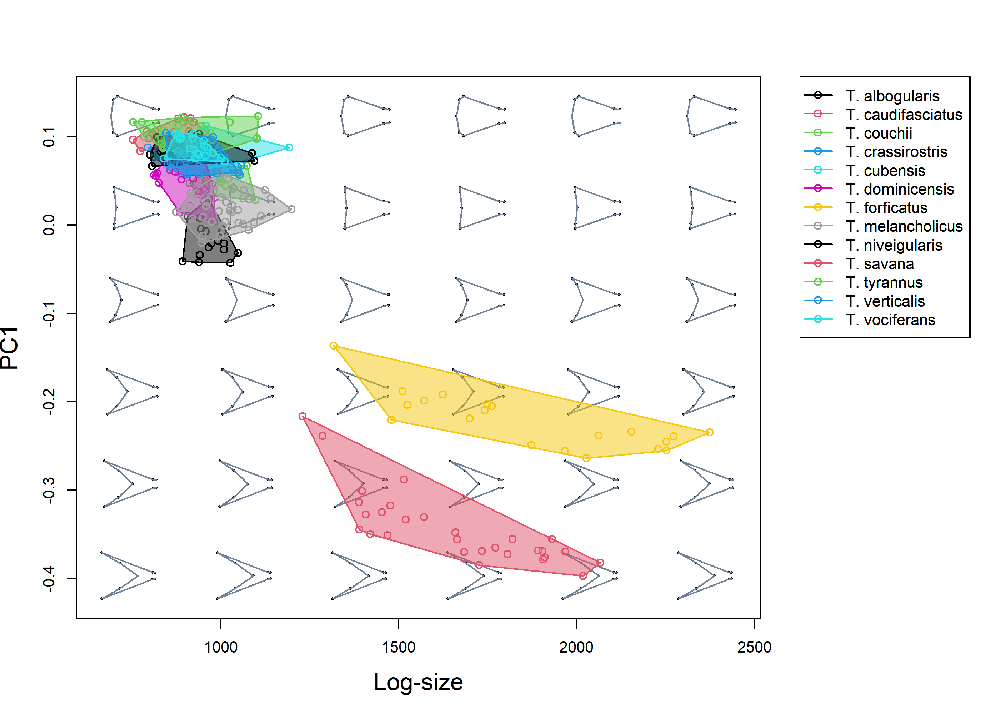

<!-- README.md is generated from README.Rmd. Please edit that file -->

# morphospace 

<!-- badges: start -->

[](https://github.com/millacarmona/morphospace/actions/workflows/R-CMD-check.yaml)
<!-- badges: end -->

The goal of `morphospace` is to enhance representation and heuristic
exploration of multivariate ordinations of shape data. This package can
handle the most common types of shape data working in integration with
other widely used R packages such as `Morpho` (Schlager 2017),
`geomorph` (Adams et al. 2021), `shapes` (Dryden 2019), and `Momocs`
(Bonhome et al. 2014), which cover other more essential steps in the
geometric morphometrics pipeline (e.g. importation, normalization,
statistical analysis).

## Installation

You can install the development version of morphospace from
[GitHub](https://github.com/) with:

``` r
# install.packages("devtools")
devtools::install_github("millacarmona/morphospace")
```

## Concept

The basic idea behind `morphospace` is to build empirical morphospaces
using multivariate ordination methods, then use the resulting ordination
as a reference frame in which elements representing different aspects of
morphometric variation are projected. These elements are added to both
graphic representations and objects as consecutive ‘layers’ and list
slots, respectively, using the `%>%` pipe operator from `magrittr`
(Bache & Wickham 2022).

The starting point of the `morphospace` workflow is a set of shapes
(i.e. morphometric data that is already free of variation due to
differences in orientation, position and scale). These are fed to the
`mspace` function, which generates a morphospace using a variety of
multivariate methods related to Principal Component Analysis. This
general workflow is broadly outlined below using the `tails` data set
from Fasanelli et al. (2022), which contains tail shapes from 281
specimens belonging to 13 species of the genus *Tyrannus*.

``` r
library(morphospace)
library(geomorph)
library(Morpho)
library(Momocs)
library(magrittr)
library(rgl)
```

``` r
# Load tail data
data("tails")

shapes <- tails$shapes
spp <- tails$data$species
wf <- tails$links
phy <- tails$tree

# Generate morphospace
mspace(shapes, links = wf, cex.ldm = 5)
```


The ordination produced by `mspace` is used as a reference frame in
which scatter points, groups centroids, convex hulls, confidence
ellipses, a phylogeny, or a set of morphometric axes can be projected
using the `proj_*` functions:

``` r
# Get mean shapes of each species
spp_shapes <- expected_shapes(shapes = tails$shapes, x = tails$data$species)

# Generate morphospace and project:
msp <- mspace(shapes = shapes, links = wf, cex.ldm = 5) %>% 
  # scatter points
  proj_shapes(shapes = shapes, col = spp) %>% 
  # groups centroids (mean shapes)
  proj_consensus(shapes = spp_shapes, bg = 1:nlevels(spp), pch = 21) %>% 
  # convex hulls enclosing groups
  proj_groups(groups = spp, alpha = 0.5) %>% 
  # phylogenetic relationships
  proj_phylogeny(tree = phy, lwd = 1.5) 
```


Once the `"mspace"` object has been created, the `plot_mspace` function
can be used to either regenerate/modify the plot, add a legend, or to
combine morphometric axes with other non-shape variables to produce
‘hybrid’ morphospaces. For example, PC1 can be plotted against size to
explore allometric patterns.

``` r
# Plot PC1 against log-size, add legend
plot_mspace(msp, x = tails$sizes, axes = 1, nh = 6, nv = 6, cex.ldm = 4, 
            alpha.groups = 0.5, col.points = spp, col.groups = 1:nlevels(spp), 
            phylo = FALSE, xlab = "Log-size", legend = TRUE)
```



Or ordination axes could be combined with a phylogenetic tree to create
a phenogram:

``` r
# Plot vertical phenogram using PC1, add a legend
plot_mspace(msp, y = phy, axes = 1, nh = 6, nv = 6, cex.ldm = 4, 
            col.groups = 1:nlevels(spp), ylab = "Time", legend = TRUE)
```


`morphospace` can also handle closed outlines (in the form of elliptic
Fourier coefficients) and 3D landmark data, as shown below briefly using
the `shells` and `shells3D`data sets:

``` r
# Load data
data("shells")

shapes <- shells$shapes
spp <- shells$data$species

# Generate morphospace
mspace(shapes, mag = 1, nh = 5, nv = 4, bg.model = "light gray") %>%
  proj_shapes(shapes = shapes, col = spp) %>%
  proj_groups(shapes = shapes, groups = spp, alpha = 0.5, ellipse = TRUE)
```


``` r
# Load data
data("shells3D")

shapes <- shells3D$shapes
spp <- shells3D$data$species
mesh_meanspec <- shells3D$mesh_meanspec

# Generate surface mesh template
meanspec_shape <- shapes[,,findMeanSpec(shapes)]
meanmesh <- tps3d(x = mesh_meanspec, 
                  refmat = meanspec_shape, 
                  tarmat = expected_shapes(shapes))

# Generate morphospace
mspace(shapes, mag = 1, bg.model = "gray", cex.ldm = 0, template = meanmesh, 
       adj_frame = c(0.9, 0.85)) %>%
  proj_shapes(shapes = shapes, col = spp, pch = 16) %>%
  proj_groups(shapes = shapes, groups = spp, alpha = 0.3)
#> Preparing for snapshot: rotate mean shape to the desired orientation
#>  (don't close or minimize the rgl device).Press <Enter> in the console to continue:
#> This will take a minute...
#> DONE.
```


Aside from working with these types of morphometric data, `morphospace`
provides functions to perform some useful shape operations, use TPS
interpolation of curves/meshes to improve visualizations, and supports a
variety of multivariate methods (bgPCA, phylogenetic PCA, PLS,
phylogenetic PLS) to produce ordinations. For these and other options
and details, go to [General
usage](https://millacarmona.github.io/morphospace/articles/General-usage.html)
and [Worked
examples](https://millacarmona.github.io/morphospace/articles/Worked-examples.html).

## Update (August 2022)

-   Different behavior for `proj_shapes` (now replaces `mspace$x` with
    the actual scores being projected) and `proj_axis` (now adds one or
    more axes into an `mspace$shapes_axis`).

-   New `ellipses_by_groups_2D` (uses `car::ellipse`) function as an
    option for `proj_groups` and `plot_mspace`.

-   Morphospaces without background shape models are now an option (for
    both `mspace` and `plot_mspace`).

-   `plot_mspace` now regenerates the original mspace plot by default
    (`proj_*` functions were modified such that all the relevant
    graphical parameters are inherited downstream to `plot_mspace`), has
    further flexibility regarding hybrid morphospaces (`plot_phenogram`
    has been updated) and allows adding a legend (and some various bugs
    were fixed as well).

-   Univariate morphospaces and associated density distributions are now
    an option (all the `mspace` workflow functions have been modified
    accordingly, especially `proj_shapes` and `proj_groups`).

-   `consensus` and `expected_shapes` have been merged in a single
    function (the name `expected_shapes` was retained as the former was
    clashing with `ape::consensus`), which can handle both factors and
    numerics.

-   Both `detrend_shapes` and `expected_shapes` can now calculate
    phylogenetically-corrected coefficients for interspecific data sets
    (Revell 2009).

## References

Adams D.C., Collyer M.L., Kaliontzopoulou A., & Baken E.K. (2021).
*geomorph: Software for geometric morphometric analyses*. R package
version 4.0.2. <https://cran.r-project.org/package=geomorph>.

Bache S.F., & Wickham H. (2022). m*agrittr: A Forward-Pipe Operator for
R*. R package version 2.0.3.
<https://CRAN.R-project.org/package=magrittr>.

Bonhomme V., Picq S., Gaucherel C., & Claude J. (2014). *Momocs: Outline
Analysis Using R*. Journal of Statistical Software, 56(13), 1-24.
<http://www.jstatsoft.org/v56/i13/>.

Dryden, I.L. (2019). *shapes: statistical shape analysis*. R package
version 1.2.5. <https://CRAN.R-project.org/package=shapes>.

Fasanelli M.N., Milla Carmona P.S., Soto I.M., & Tuero, D.T. (2022).
*Allometry, sexual selection and evolutionary lines of least resistance
shaped the evolution of exaggerated sexual traits within the genus*
Tyrannus. Journal of Evolutionary Biology, in press.
<https://doi.org/10.1111/jeb.14000>.

Revell, L.J. (2009). *Size-correction and principal components for
interspecific comparative studies*. Evolution, 63, 3258-3268
<https://doi.org/10.1111/j.1558-5646.2009.00804.x>.

Schlager S. (2017). *Morpho and Rvcg - Shape Analysis in R*. In Zheng
G., Li S., Szekely G. (eds.), *Statistical Shape and Deformation
Analysis*, 217-256. Academic Press.
<https://doi.org/10.1016/B978-0-12-810493-4.00011-0>.
