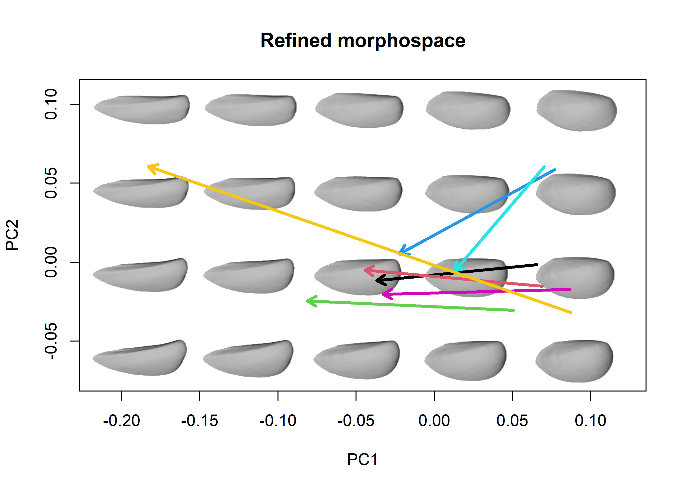
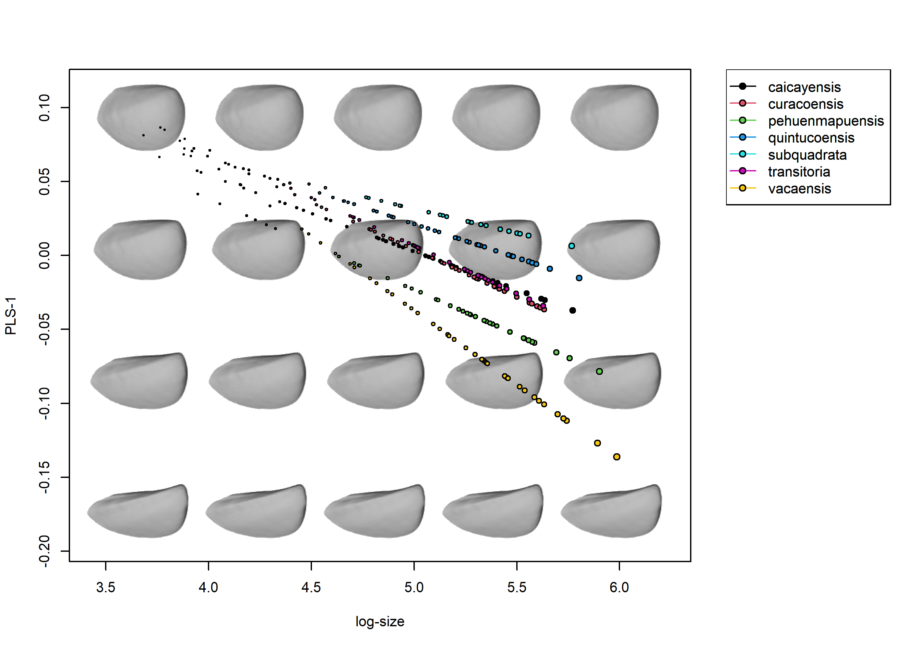

```{r, include = FALSE}
knitr::opts_chunk$set(
  collapse = TRUE,
  comment = "#>",
  out.width = "100%",
  fig.width = 7,
  fig.height = 4.73,
  dpi = 500
)
options(rgl.useNULL=TRUE) 
```


`morphospace` has been built to work with different types of geometric morphometrics data in intergration with other widely used R packages that cover more essential steps in the geometric morphometrics pipeline (e.g. importation, normalization, statistical analysis) such as `Morpho` (Schlager 2017), `geomorph` (Adams et al. 2021), `shapes` (Dryden 2019), and `Momocs` (Bonhome et al. 2014). Below, the general concept and capabilities of  `morphospace` are showcased using four data sets representing these data types and various spatio-temporal scales that are typically addressed when studying evolutionary variation.


```{r, message = FALSE}
library(morphospace)
library(geomorph)
library(Morpho)
library(magrittr)
```


## 2D Landmark data

The first data set, taken from from Fasanelli et al. (2022), contains a sample of tail shapes from the 13 species of the genus *Tyrannus*, two of which (*T. savana* and *T. forficatus*) display exaggeratedly elongated tails, as well as a considerable allometric variation and sexual dimorphism. The `tails` data set contains landmark data and centroid sizes from the tails of 281 specimens, their classification to species and sex, and the phylogenetic relationships between *Tyrannus* species (see Fasanelli et al. 2022 and references therein). The links between landmarks have been included to help shape visualization.


```{r}
# Load tail data and extract shapes, centroid sizes, classification of sex and species,
# links between landmarks, and phylogenetic tree
data("tails")

shapes <- tails$shapes
species <- tails$data$species
sizes <- log(tails$sizes)
sex <- tails$data$sex
links <- tails$links
tree <- tails$tree
```

Morphometric variation is assumed to be already free of variation due to differences in orientation, position and scale. This standardization can be readily performed using a number of functions provided by the aforementioned R packages.

```{r}
# Inspect shapes
pile_shapes(shapes, links = links)
```

This package provide some functions that perform basic operations with shape variables, such as the calculation of mean shapes or the analytical removal of undesired sources of variation. Suppose, for example, that we are interested in allometric and interspecific variation, and sexual dimorphism represents a nuisance factor which we want to get rid of. We can do this using `detr_shapes` (and compute species' mean shapes using `consensus`).

```{r}
# Remove variation associated with sexual dimorphism and compute the consensus shape
# of each species
detr_shapes <- arrayspecs(detrend_shapes(model = lm(two.d.array(shapes) ~ sex)),
                          p = nrow(shapes), k = ncol(shapes))
sp_shapes <- consensus(shapes = detr_shapes, index = species)
```


The basic idea behind the `morphospace` workflow is to build (empiric) morphospaces using multivariate methods (PCA and the like), then use the resulting ordination as a reference in which to project different elements depicting various aspects of morphometric variation. These elements are added both to the plot and the `"mspace"` object as consecutive 'layers' and list slots, respectively, using the `%>%` pipe operator from `magrittr` (Bache & Wickham 2022).


```{r}
# Generate morphospace using detrended shapes, project specimens
morphospace1 <- mspace(detr_shapes, links = links, cex.ldm = 5) %>%
  proj_shapes(shapes = detr_shapes)
title("Morphospace")


# Generate morphospace, project specimens and delimit species' ranges of variation
# using convex hulls
morphospace2 <- mspace(detr_shapes, links = links, cex.ldm = 5) %>%
  proj_shapes(shapes = detr_shapes, col = species) %>%
  proj_groups(shapes = detr_shapes, groups = species)
title("Morphospace\n+ taxonomic classification")


# Generate morphospace, project each species' mean shape and range of variation
morphospace3 <- mspace(detr_shapes, links = links, cex.ldm = 5) %>%
  proj_consensus(shapes = sp_shapes, pch = 21, bg = 1:nlevels(species), cex = 1.2) %>%
  proj_groups(shapes = detr_shapes, groups = species)
title("Morphospace\n+ species mean shapes and ranges of variation")


# Generate morphospace, project species' mean shapes and phylogenetic structure
# (requires a "phy" object and the earlier addition of mean shapes corresponding
# to the tips)
morphospace4 <- mspace(detr_shapes, links = links, cex.ldm = 5) %>%
  proj_consensus(shapes = sp_shapes, pch = 21, bg = 1:nlevels(species), cex = 1.2) %>%
  proj_phylogeny(tree = tree, pch = 16)
title("Morphospace\n+ phylogeny")


# Check the elements of each mspace object, note the slots corresponding to groups 
# mean shapes and classification, the phylogenetic structure and scores for nodes
# and tips.
names(morphospace1)
names(morphospace2)
names(morphospace3)
names(morphospace4)
```


Another potentially interesting element that can be projected into morphospaces are morphometric axes, i.e. synthetic axes built as linear combinations of shape variables. For example, we can project the first two PC axes resulting from the PCA of our shape data into our morphospace (yes, this is redundant).


```{r}
# perform PCA of refined shape variables, create morphospace, and project the first 2 
# axes from the former into  the latter
pca <- prcomp(two.d.array(detr_shapes))
mspace(detr_shapes, links = links, cex.ldm = 5) %>%
  proj_shapes(shapes = detr_shapes, col = species) %>%
  proj_groups(shapes = detr_shapes, groups = species) %>%
  proj_consensus(shapes = sp_shapes, pch = 21, bg = 1:13, cex = 1.2) %>%
  proj_phylogeny(tree = tree, pch = 16) %>%
  proj_axis(obj = pca, axis = 1, col = "black", lwd = 2, lty = 2) %>%
  proj_axis(obj = pca, axis = 2, col = "black", lwd = 2, lty = 2)
title("Morphospace\n+ PCs 1 and 2 projected")
```


## Ordination methods

The default settings of `mspace` rely on the `prcomp` function from the `stats` package to perform the PCA that builds the synthetic morphometric space. However, `morphospace` also includes functions for supervised ordination, namely phylogenetic PCA (Revell 2009; borrowed from `phytools`, Revell 2012), between-groups PCA (`bg_prcomp`), and both ordinary and phylgenetic versions of Partial Least Squares (PLS) (`pls_shapes` [which is an user-friendly wrapper of `pls2b`, which is used in the following chunk]). These have been styled/wrapped so they share format with `prcomp`, and the latter allow for leave-one-out cross-validation (LOOCV), which alleviates some spurious patterns that arise when the number of variables exceeds the number of samples (as it is common in geometric morphometric analyses; see Cardini et al. 2019 and Cardini & Polly 2020).

```{r}
# Simulate 100 random normal distributions, and add an artificial classification and
# an artificial covariate
set.seed(123)
random_y <- do.call("cbind", lapply(1:100, function(i) {rnorm(90)}))
class <- factor(rep(c("A", "B", "C"), each = 30))
random_x <- rnorm(90)


# Perform bgPCA on the set of random variables to look for the bgPCs maximizing separation
# between artificial groups, with and without LOOCV
layout(cbind(1,2))
bgpca1 <- bg_prcomp(x = random_y, groups = class)
plot(bgpca1$x, col = c(1:3)[class])
hulls_by_group_2D(bgpca1$x, class)
title("without LOOCV")


bgpca2 <- bg_prcomp(x = random_y, groups = class, LOOCV = TRUE)
plot(bgpca2$x, col = c(1:3)[class])
hulls_by_group_2D(bgpca2$x, class)
title("with LOOCV")


# Perform PLS on the set of random variables to look for the PLS axis maximzing covariation
# between them and the artificial covariate, with and without LOOCV
layout(cbind(1,2))
pls1 <- pls2b(x = random_x, y = random_y)
plot(pls1$xscores, pls1$yscores)
abline(lm(pls1$yscores ~ pls1$xscores), col = "red")
title("without LOOCV")


pls2 <- pls2b(x = random_x, y = random_y, LOOCV = TRUE)
plot(pls2$xscores, pls2$yscores)
abline(lm(pls2$yscores ~ pls2$xscores), col = "red")
title("with LOOCV")
dev.off()

```


These methods can be used instead of regular PCA for building morphospaces via the `FUN` and `...` arguments (adding the argument `groups` for `bg_prcomp`, `tree` for `phy_prcomp`, and `X` [and potentially also a `tree`] for `pls_shapes`) of the `mspace` function. The resulting morphospace can be combined with the rest of the functions in the same way as before:


```{r}
# Phylogenetic PCA for all species
mspace(sp_shapes, FUN = phy_prcomp, tree = tree, links = links,
       xlim = c(-0.25, 0.15), ylim = c(-0.2, 0.15), cex.ldm = 5) %>%
  proj_consensus(shapes = sp_shapes, bg = 1:nlevels(species), pch = 21) %>%
  proj_phylogeny(tree = tree, pch = 16)
title("Phylogenetic morphospace")


# Phylogenetic PCA for all species, adding projection of intrapspecific variation
mspace(sp_shapes, FUN = phy_prcomp, tree = tree, links = links,
       xlim = c(-0.25, 0.15), ylim = c(-0.2, 0.15), cex.ldm = 5) %>%
  proj_shapes(shapes = detr_shapes, col = species) %>%
  proj_groups(shapes = detr_shapes, groups = species) %>%
  proj_consensus(shapes = sp_shapes, col = "black", pch = 16) %>%
  proj_phylogeny(tree = tree, pch = 16)
title("Phylogenetic morphospace\n+ samples")


# Between group PCA - all species (invert both axes for easier comparison with previous plots)
mspace(detr_shapes, FUN = bg_prcomp, LOOCV = TRUE, groups = species,
       links = links, invax = c(1,2), cex.ldm = 5) %>%
  proj_shapes(shapes = detr_shapes, col = species) %>%
  proj_groups(shapes = detr_shapes, groups = species)
title("Morphospace emphasizing interspecific variation")
```


The rationale of constructing a reference ordination using a given sample of shapes and then projecting other elements into it (computed from either the same or a different but compatible sample of shapes) can be used to sequentially construct rather complex graphics. 

For example, we may are interested in the patterns of interspecific variation and thus we could want to avoid the heavy influence that the marked divergence of deep forked (DF) species exert over the PC axes (which causes all the non-deep forked (NDF) species to be collapsed in a tiny region of the morphospace). We can subset our shapes to retain only NDF species, build an ordination using a bgPCA between them (so our axes maximize the interspecific variation between NDF species), and then project the samples corresponding to DF species into the resulting morphospace.


```{r}
# Between group PCA - only NDF species, then project the entire sample
index <- tails$data$type == "NDF"
detr_shapes_ndf <- detr_shapes[,,index]
species_ndf <- factor(species[index])
sizes_ndf <- sizes[index]

morphospace <- mspace(detr_shapes_ndf, FUN = bg_prcomp, groups = species_ndf, cex.ldm = 5,
                      links = links, xlim = c(-0.4, 0.1), ylim = c(-0.13, 0.1), invax = 1) %>%
  proj_consensus(shapes = sp_shapes, pch = 21, bg = 1:nlevels(species)) %>%
  proj_shapes(shapes = detr_shapes, col = species) %>%
  proj_groups(shapes = detr_shapes, groups = species)
title("Interspecific NDF morphospace\n+ all samples and mean shapes")
```

Let's say we want to project the axis representing the allometric variation of each species(e.g. a PLS of shape vs centroid size), so we can see whether these are aligned with each other or with the axes maximizing NDF interspecific variation. Suppose we also want to project the phylogenetic relationships into our morphospace so we can say we have a phylomorphospace (Sidlauskas 2008). The following chunk of code illustrates how to combine the pipe workflow described above with `proj_*` functions called outside the pipe.

(Also, the standard `graphics` tools work here, so we manipulate the margins of the figure a bit and add a legend. Yes, some colors repeat, is up to the user to find the right color palette.)

```{r}
# NDF bgPCA + projection of the entire sample + projection of phylogenetic relationships, add legend
omar <- par("mar")
par(mar = c(5.1, 4.1, 4.1, 6), xpd = TRUE)

morphospace <- mspace(detr_shapes_ndf, FUN = bg_prcomp, groups = species_ndf, cex.ldm = 5,
                      links = links, xlim = c(-0.4, 0.1), ylim = c(-0.13, 0.1), invax = 1) %>%
  proj_consensus(shapes = sp_shapes, pch = 21, bg = 1:nlevels(species)) %>%
  proj_shapes(shapes = detr_shapes, col = species) %>%
  proj_groups(shapes = detr_shapes, groups = species) %>%
  proj_phylogeny(tree = tree)
# Project the allometric axis (i.e., the PLS axis maximizing correlation between shape and
# size) calculated separatedly for each species
for(i in 1:nlevels(species)){
  index <- species==levels(species)[i]
  subshapes <- detr_shapes[,,index]
  subsizes <- sizes[index]
  pls <- pls_shapes(shapes = subshapes, X = subsizes)
  proj_axis(obj = pls, morphospace, axis = 1, pipe = FALSE, col = "blue", lwd = 2)
}
title("Interspecific NDF morphospace\n+ all samples and mean shapes\n+ intraspecific allometric axes")
legend("topright", inset = c(-0.22, 0), legend = levels(species), 
       cex = 0.7, pch = 16, col = 1:nlevels(species), bty = "n", text.font = 3)
par(mar = omar)
```


## Flexible visualization

The `"mspace"` objects created using the `mspace %>% proj_*` pipeline can be plotted with `plot_mspace`, which adds further flexibility to the whole depiction thing. By plotting a `"mspace"` object using this function we can select a different set of axes to plot, colors and symbols for points, groups, etc (or not).


```{r, fig.show='hide'}
# Generate a mspace object
morphospace <- mspace(detr_shapes, links = links, cex.ldm = 5)  %>%
  proj_shapes(shapes = detr_shapes, col = species) %>%
  proj_groups(shapes = detr_shapes, groups = species) %>%
  proj_consensus(shapes = sp_shapes, pch = 21, bg = 1:nlevels(species), cex = 1.2) %>%
  proj_phylogeny(tree = tree, pch = 16)
```

```{r}
# The funcion plot_mspace can take an object created with mspace + projections
# and plot it.
plot_mspace(mspace = morphospace, points = TRUE, mshapes = FALSE, groups = FALSE, phylo = FALSE)
title("A morphospace plotted with plot_mspace")


# The elements added through mspace pipes can be added using the corresponding arguments
plot_mspace(mspace = morphospace, groups = TRUE, points = TRUE,
            col.points = species, col.groups = 1:nlevels(species),
            mshapes = FALSE, phylo = FALSE)
title("Same morphospace with additional elements")


# The function allows modification different aspects of the plot, such as the axes
# to be plotted, the number of shape models in the background or the size of their landmarks
plot_mspace(mspace = morphospace, links = links, axes = c(1,3), nh = 3, points = TRUE,
            col.points = species, col.groups = 1:nlevels(species), cex.ldm = 5,
            col.ldm = "red", mshapes = FALSE, groups = TRUE, phylo = FALSE)
title("Same morphospace, axes 1 and 3, and with a different background")
```

In addition, `plot_mspace` allows specification of an external, non-shape variable (or, alternatively, a phylogenetic tree) to be combined with the axes of our morphospace to create 'hybrid' morphospaces. For example, if we provide a phylogenetic tree for the `x` argument of `plot_mspace`, we get a phenogram:


```{r, fig.show='hide'}
# A phylogenetic tree can be included to produce a phenogram
phylomorphospace <- mspace(sp_shapes, links = links, invax = 1)  %>%
  proj_consensus(shapes = sp_shapes) %>%
  proj_phylogeny(tree = tree)
```

```{r}
# Plot phenogram, add legend
omar <- par("mar")
par(mar = c(5.1, 4.1, 4.1, 6), xpd = TRUE)

plot_mspace(phylomorphospace, x = tree, axes = 1, nh = 6, nv = 6, cex.ldm = 4, 
            col.groups = 1:nlevels(species), xlab = "branch length")
title("Phenogram")
legend("topright", inset = c(-0.22, 0), legend = levels(species), 
       cex = 0.7, pch = 16, col = 1:nlevels(species), bty = "n", text.font = 3)
par(mar = omar)
```


`mspace` (and `plot_mspace`) can also be feeded with a curve or set of curves outlining aspects of the phenotype not captured by the chosen landmarks, that can help 'see' the structure in which they have been placed on. We show this using the `wings` data set, which has been taken from Soto et al. (2012) and includes wing shape data from 263 experimentally bred specimens belonging to two recently diverged cactophilic *Drosophila* species, *D. koepferae* and *D. buzzattii*. These two species show preference to different host cacti (columnar cacti from the genus *Trichocereus* and prickly pears from the genus *Opuntia*, respectively) and are considered morphologically cryptic (usually, they can be recognized only from genital morphology). The data set include the centroid size of each wing, as well as information on the host cacti each specimen was bred, its species, sex, isofemale line, and replica. Also included is a template containing a series of curves describing wing outline and veins (created using `build_template2d`), which will be warped using TPS interpolation and used to generate fancy shape models for our morphospace.


```{r}
# Load wing data and extract shapes, centroid sizes, classification of sex and species,
# links between landmarks, template, and phylogenetic tree
data("wings")

shapes <- wings$shapes
sizes <- log(wings$sizes)
species <- wings$data$species
cactus <- wings$data$cactus
line <- wings$data$line
sex <- wings$data$sex
replica <- wings$data$replica
template <- wings$template

# Generate morphospace with warped wings, with variation amplified x2
mspace(shapes, template = template, col.ldm = "red", cex.ldm = 5) %>%
  proj_shapes(shapes = shapes, col = c("blue", "green")[species], pch = c(1,16)[cactus]) %>%
  proj_groups(groups = species, col = c("blue", "green"))
title("Morphospace using template")
```

Assume for a second we are interested in exploring whether we can identify morphological differences between species and/or the host cactus each group was bred on. The pattern we are seeing suggets that variation in wing morphology is very subtle, that wings of these two species are basically indistinguishable, and that cactus has a large effect on wing morphology. However, there is a lot of noise can get rid o using `detrend_shapes`, and we can also use the `mag` argument to magnify variation.

```{r}
# Remove variation from  sex, line, replica and size
detr_shapes <- arrayspecs(
  detrend_shapes(lm(two.d.array(shapes) ~ sex * line * replica * sizes)), 
  p = 9, k = 2)

# Generate morphospace using the refined variation, magnify transformation
mspace(detr_shapes, template = template, col.ldm = "red", cex.ldm = 5, mag = 3) %>%
  proj_shapes(shapes = detr_shapes, col = c("blue", "green")[species], pch = c(1,16)[cactus]) %>%
  proj_groups(groups = species, col = c("blue", "green"))
title("Refined morphospace using template")
```


We can see interspecific differences more clearly now. We can use `bg_prcomp` to explore if there is any other difference in wing morphology associated to species and cactus.


```{r}
# Generate morphospace using the magnified refined variation and bgPCA between cactus x species, add legend
omar <- par("mar")
par(mar = c(5.1, 4.1, 4.1, 6), xpd = TRUE)

morphospace <- mspace(detr_shapes, axes = c(1,2), FUN = bg_prcomp, groups = cactus:species,
                      col.ldm = "red", cex.ldm = 5, template = template, 
                      nh = 2, nv = 2, mag = 2, size.models = 0.25) %>%
  proj_shapes(shapes = detr_shapes, col = c("blue", "green")[species], pch = c(1,16)[cactus]) %>%
  proj_groups(groups = species:cactus, col = c("blue", "blue", "green", "green"))
legend("topright", inset = c(-0.2, 0), legend = c("D. buzzattii", "D. koepferae"), 
       cex = 0.7, pch = 16, col = c("blue", "green"), bty = "n", text.font = 3)
title("bgPCA (1-2) between species x cactus")

# plot bgPCs 1 and 3, add legend
plot_mspace(morphospace, axes = c(1,3), col.ldm = "red", nh = 2, nv = 2,
            pch.points = c(1,16)[cactus], col.points = c("blue", "green")[species],
            col.groups = rep(c("blue", "green"), each = 2))
legend("topright", inset = c(-0.2, 0), legend = c("D. buzzattii", "D. koepferae"), 
       cex = 0.7, pch = 16, col = c("blue", "green"), bty = "n", text.font = 3)
title("bgPCA (1-3) between species x cactus")
par(mar = omar)
```


## Closed outlines

`morphospace` can also handle closed outline data in the form of Fourier coefficients resulting from an elliptic Fourier analysis. For the purposes of import, normalize and and analize this data we rely on the `Momocs` package, and use its `"OutCoe"` format for storing closed outlines as starting point. Below the `mspace %>% proj_*` workflow is applied to the `shells` data set taken from Milla Carmona et al. (2018). This include data from 137 specimens belonging to 4 species of the extinct bivalve genus *Ptychomya*, tracking their shape changes through a 5 million years interval from the Lower Cretaceous of Argentina. The data set includes the information about the shape (measured using 7 harmonics), centroid size, geochronologic age (both relative and absolute), geographic provenance, and taxonomic classification of each specimen.


```{r}
# Load data from shells, extract shapes, sizes and classification into species, absolute and relative
# age and locality
data("shells")

shapes <- shells$shapes$coe
sizes <- log(shells$sizes)
species <- shells$data$species
ages <- shells$data$age
bzones <- shells$data$zone
locality <- shells$data$locality

# Pile shapes
pile_shapes(shapes)

# Generate morphospace using raw variation
mspace(shapes, mag = 1, axes = c(1,2), nh = 5, nv = 4, bg.model = "light gray") %>%
  proj_shapes(shapes = shapes, col = species) %>%
  proj_groups(shapes = shapes, groups = species)
title("Morphospace")
```

All the same fun stuff can be done here. For example we might be interested in refining variation to show the main differences between species, and so we could use `detrend_shapes` to remove variation associated with geographic provenance and allometric variation (which in this case isn't of interest) within each species, and then use `consensus` to extract the mean shape of the sample.

(*Note: we do this in a two step process for a good reason: when we use* `detrend_shapes` *to detrend shape variation, the grand mean is used by default as the new mean shape of the sample; however by specifying a value or level of* `x` *from the model in the* `xvalue` *argument, we can use that new value as the mean shape for our 'detrended' shape variation. In this case, we are analitically displacing all the shells to the shape they would have if they had attained their species' maximum size)*.

*(Also, note that we don't need* `arrayspecs` *when using* `detrend_shapes` *here, that's because Fourier coefficients are already stored in matrix format)*.

```{r}
# 'Clean' shapes separately for each species, removing 1) variation associated
# to geographic provenance and 2) allometric variation
detr_shapes <- shapes * 0
for(i in 1:nlevels(species)) {
  index <- species == levels(species)[i]

  submod_loc <- lm(shapes[index,] ~ factor(locality[index]))
  detr_shapes0 <- detrend_shapes(submod_loc)

  submod_siz <- lm(detr_shapes0 ~ sizes[index])
  subdetr_shapes1 <- detrend_shapes(submod_siz, xvalue = max(sizes[index]))

  detr_shapes[rownames(detr_shapes) %in% rownames(subdetr_shapes1),] <- subdetr_shapes1
}

# Compute mean shapes
sp_shapes <- consensus(detr_shapes, species)
```

We can now build the refined morphospace using `bg_prcomp` and project our sample, groups, mean shapes and the main axis of intraspecific variation of each species just to show that outlines and bivalves can be cool too.

```{r}
# Generate morphospace from the 'refined' variation, further enhancing interspecific
# variation by using a bgPCA
morphospace1 <- mspace(detr_shapes, FUN = bg_prcomp, groups = species, nh = 5, nv = 4, 
                       bg.model = "light gray") %>%
  proj_shapes(shapes = detr_shapes, col = species) %>%
  proj_consensus(shapes = sp_shapes, pch = 16) %>%
  proj_groups(shapes = detr_shapes, groups = species)
# Project the axis of maximum intraspecific variation of each species (i.e. a PCA
# of the subsamples corresponding gto each species)
for(i in 1:nlevels(species)){
  subshapes <- detr_shapes[species == levels(species)[i],]
  pca <- prcomp(x = subshapes)
  proj_axis(obj = pca, morphospace1, axis = 1, pipe = FALSE, lwd = 2, col = i)
}
title("Morphospace emphasizing interspecific variation")
```

Finally, we can use `plot_mspace` again to create more complex hybrid plots. In this case, say are interested in the anagenetic evolution of these species, so we want to plot the first PC together with the time axis. To do so, we do a little variable manipulation first to obtain the classification of each specimen to the combination of (relative) age and species, then build the morphospace, then use `plot_mspace` to plot geochronologic age against shape. Finally, we calculate the (absolute) ages from each combination, bind them to the groups means, order them and use that to depict the mean shape changes of each species through time:

```{r, fig.show='hide'}
# Combine species and biozones factors, then compute the mean shapes of the resulting
# groups
sp.bz <- factor(species:bzones)
mshapes_agesxspecies <- consensus(shapes, sp.bz)


# Generate morphospace
morphospace2 <- mspace(shapes, nh = 5, nv = 4, bg.model = "light gray") %>%
  proj_shapes(shapes = shapes) %>%
  proj_consensus(shapes = mshapes_agesxspecies) %>%
  proj_groups(shapes = shapes, groups = sp.bz)

```

```{r}
# Plot time axis vs first PC, add legend
omar <- par("mar")
par(mar = c(5.1, 4.1, 4.1, 6), xpd = TRUE)

plot_mspace(mspace = morphospace2, x = ages, axes = 1, nh = 5, nv = 4, xlab = "Time (MA)",
            col.points = species,  phylo = FALSE, groups = FALSE, mshapes = TRUE)
# Compute and arrange absolute ages for each group, then use it to add and connect mean shapes
xy <- cbind(tapply(ages, sp.bz, mean), morphospace2$gr_centroids[,1])
xy <- xy[order(xy[,1]),]
for(i in 1:4) {
  index <- grepl(x = rownames(xy), pattern = levels(species)[i])
  lines(xy[index,], col = i, lwd = 2)
  points(xy[index,], pch = 21, bg = i)
}
title(' "Stratomorphospace" ')
legend("topright", inset = c(-0.22, 0), legend = paste0("P. ", levels(species)), 
       cex = 0.7, pch = 16, col = 1:nlevels(species), bty = "n", text.font = 3)
par(mar = omar)

```


## 3D Landmark data


Last but not least, `morphospace` can also deal with 3D landmark data (my personal preference for importing and normalizing 3D landmark data are the functions from `Morpho`, but other packages can do this too). To show how to apply `mspace %>% proj_*` we use the `shells3D` data set taken from Milla Carmona et al. (2021), which gathers longitudinal ontogenetic data from 67 specimens belonging to 7 species of the extinct bivalve genus *Steinmanella* from the Lower Cretaceous of Argentina. The shape of these specimens was registered at different sizes using growth lines, and so the data set includes a total of 278 shapes quantified using 90 surface semilandmarks. Also included are the corresponding centroid sizes, the id of the specimen each shape was taken from, and information about relative age, taxonomic classification and geographic provenance of each specimen. The surface mesh corresponding to the specimen closest to the consensus of the sample (found using `geomorph::findMeanSpec`) is also included.


The `rgl` package (Murduch & Adler 2021) is responsible for depiction of 3D models, which imposes some important differences in the way `morphospace` functions work. Most importantly, each time `mspace` or `plot_mspace` is called, a `rgl` device will pop up and we will be asked to rotate a reference shape to a desired orientation. **Do not close or minimize this window**, just expand the window and/or rotate and zoom in/out the model and then go to the console and hit Enter there directly. 


```{r, include = TRUE}
# (You wouldn't normally need this step, but because I cannot rotate the device when knitting 
# this becomes necessary. However, it can also be useful to use ir in your workflow too, so you 
# dont need to worry about finding exactly the same orientation over and over again.)
par3d(userMatrix = 
        matrix(c(-0.92221391,-0.37156740,-0.10704762,0,-0.37703809,
                 0.92551011,0.03568961,0,0.08581252,0.07327446,
                 -0.99361324,0,0,0,0,1), nrow = 4, ncol = 4, byrow = TRUE)
)
```

```{r}
# Load data from 3D shells, extract shapes and classification into species
data("shells3D")

shapes <- shells3D$shapes
sizes <- log(shells3D$sizes)
species <- shells3D$data$species
ind <- shells3D$data$individual
bzones <- shells3D$data$biozone
locality <- shells3D$data$locality
mesh_meanspec <- shells3D$mesh_meanspec

# Pile shapes
pile_shapes(shapes, alpha = 0.2)
```

```{r testrgl, echo = FALSE}
# Pile shapes
pile_shapes(shapes, alpha = 0.2)
rglwidget(width = 700, height = 700)
```

```{r eval = F}
# Create morphospace using raw variation. This is interactive, you need 
# to rotate the 3D model by yourself and then press enter into the console
mspace(shapes, cex.ldm = 2) %>%
  proj_shapes(shapes = shapes, col = species, pch = 16) %>%
  proj_groups(shapes = shapes, groups = species)
title("Morphospace")
```


```{r echo = FALSE, warning=FALSE}
#I just couln't find how to make knitr to generate these figures right so my apologies this is the
#best way I found to show them :(
knitr::include_graphics("vignette-unnamed-chunk-24-1.png")
```

As with 2D landmarks we can include a template to improve interpretability, although in this case this template is a 3D surface mesh. This can slow down the process considerably, especially if we ask for too many models or use transparent meshes. The template used must be the mesh corresponding to the mean shape, which needs to be computed beforehand (the `shells3D` data set includes the mesh corresponding to the specimen closest to the consensus, which can be warped using `Morpho::tps3d` to obtain the mean mesh, as shown in the next chunk).

```{r eval = F}
# Generate morphospace using raw variation, but with a mesh template that improves
# visualization:

# First, get shape corresponding to shells3D$mesh_meanspec using geomorph::findMeanSpec,
meanspec_id<- findMeanSpec(shapes)
meanspec_shape <- shapes[,,meanspec_id]

# Then get consensus shape and warp the mean spec mesh to get the mesh corresponding to the
# consensus using Morpho::tps3d
meanshape <- consensus(shapes)
meanmesh <- tps3d(x = mesh_meanspec , refmat = meanspec_shape, tarmat = meanshape)

# Finally, create morphospace providing template (this function used the mesh warped to
# the mean shape of the entire sample, hence the previous lines). When projecting
# the scores, make their size proportionla to log centroid size
mspace(shapes, bg.model = "gray", cex.ldm = 0, template = meanmesh) %>%
  proj_shapes(shapes = shapes, col = species, pch = 1, cex = (sizes/max(sizes))^2) %>%
  proj_groups(shapes = shapes, groups = species)
title("Same morphospace with fancier background")
```

```{r echo = FALSE, warning=FALSE}
knitr::include_graphics("vignette-unnamed-chunk-25-1.png")
```

So, with this sorted out we can focus on morphometric variation to better represent ontogenetic trajectories. Again we resort to `detrend shapes` to remove variation coming from undesired sources (which in this case are age, provenance and, especialy, individual differneces).

```{r eval = F}
# Remove nuisance variation from the sample, for each species (a couple were registered
# in a single biozone and/or locality, which require little adjustments)
detr_shapes <- shapes * 0
for(i in 1:nlevels(species)) {
  index <- species == levels(species)[i]
  subshapes <- shapes[,,index]
  subind <- ind[index]
  subloc <- locality[index]
  subzone <- bzones[index]

  if(!any(i == c(4, 5))) {
    detr_shapes[,,index] <- arrayspecs(
      detrend_shapes(model = lm(two.d.array(subshapes) ~ subind * subzone * subloc)),
      p = nrow(shapes), k = ncol(shapes))
  } else {
    if(i == 4){
      detr_shapes[,,index] <- arrayspecs(
        detrend_shapes(model = lm(two.d.array(subshapes) ~ subind)),
      p = nrow(shapes), k = ncol(shapes))
    } else {
      detr_shapes[,,index] <- arrayspecs(
        detrend_shapes(model = lm(two.d.array(subshapes) ~ subind * subloc)),
      p = nrow(shapes), k = ncol(shapes))
    }
  }
}
```

Once we got rid of the noise, we use the refined shapes to compute the allometric axis of each species using `pls_shapes`. Then, we use the former to generate a morphospace in which to project the latter (we also generate a new mean mesh for the detrended sample). 

```{r eval = F}
# Compute allometric axis of each species using pls_shapes
pls_list <- lapply(1:nlevels(species), function(i) {
  index <- species == levels(species)[i]
  subshapes <- detr_shapes[,,index]
  subsizes <- sizes[index]

  pls_shapes(shapes = two.d.array(subshapes), X = subsizes)

})


# Compute mean shape and mean mesh for the detrended sample
detr_meanshape <- consensus(detr_shapes)
detr_meanmesh <- tps3d(x = mesh_meanspec , refmat = meanspec_shape, tarmat = detr_meanshape)


# Generate morphospace from refined variation and project allometric axis, add legend
omar <- par("mar")
par(mar = c(5.1, 4.1, 4.1, 6.5), xpd = TRUE)

morphospace <- mspace(detr_shapes, template = meanmesh, bg.model = "gray", 
                      cex.ldm = 0, invax = 1, adj_frame = c(0.9, 0.85)) %>%
  proj_shapes(shapes = detr_shapes, cex = 0, col = species)
for(i in 1:nlevels(species)) {
  proj_axis(obj = pls_list[[i]], mspace = morphospace, lwd = 3, col = i, type = "b",
            cex = c(1,2), axis = 1, pipe = FALSE)
}
legend("topright", inset = c(-0.25, 0), legend = paste0("P. ", levels(species)), 
       cex = 0.7, pch = 16, col = 1:nlevels(species), bty = "n", text.font = 3)
title("Refined morphospace")
```

```{r echo = FALSE, warning=FALSE}

```

```{r, eval=F}
par(mar = omar)
```


Finally, we can also use `plot_mspace` to plot the general allometric axis (i.e. computed for the entire sample rather than species-wise) against size. Again we can use all the R machinery to add extra elements, in this case the values expected under the linear regression of shape on log-size.


```{r eval = F}
# Create allomorphospace (I'm just making up names at this point) using PLS 
# to emphasize allometric variation (this could take a while)
allomorphospace <- mspace(detr_shapes, FUN = pls_shapes, X = sizes, LOOCV = TRUE, axes = c(1,1),
                   bg.model = "gray", cex.ldm = 0, template = meanmesh, invax = 1, plot = FALSE)

# Use plot_mspace to create hybrid morphospace with shape against logsize, add legend
omar <- par("mar")
par(mar = c(5.1, 4.1, 4.1, 6.5), xpd = TRUE)

plot_mspace(allomorphospace, x = sizes, axes = 1, col.points = species, points = FALSE, 
            xlab = "log-size", xlim = range(sizes), adj_frame = c(0.9, 0.85))
legend("topright", inset = c(-0.25, 0), legend = paste0("P. ", levels(species)), 
       cex = 0.7, pch = 16, col = 1:nlevels(species), bty = "n", text.font = 3)
title(' "Allomorphospace "')
for(i in 1:nlevels(species)) {
  index <- species == levels(species)[i]
  mod <- lm(allomorphospace$x[index,1] ~ sizes[index])
  #dat <- cbind(sort(sizes[index]), mod$fitted[order(sizes[index])])
  #lines(dat, col = i, lwd = 2)
  dat <- cbind(sizes[index], mod$fitted)
  points(dat, cex = (sizes[index]/max(sizes[index]))^3, pch = 21, bg = i)
}
```

```{r echo = FALSE, warning=FALSE}

```

```{r, eval=F}
par(mar = omar)
```


## References

Adams D.C., Collyer M.L., Kaliontzopoulou A., & Baken E.K. (2021). *geomorph: Software for geometric morphometric analyses*. R package version 4.0.2. <https://cran.r-project.org/package=geomorph>.

Bache S.F., & Wickham H. (2022). m*agrittr: A Forward-Pipe Operator for R*. R package version 2.0.3. <https://CRAN.R-project.org/package=magrittr>.

Bonhomme V., Picq S., Gaucherel C., & Claude J. (2014). *Momocs: Outline Analysis Using R*. Journal of Statistical Software, 56(13), 1-24.  <http://www.jstatsoft.org/v56/i13/>.

Cardini A., O’Higgins P., & Rohlf F.J. (2019). *Seeing distinct groups where there are none: spurious patterns from between-group PCA*. Evolutionary Biology, 46(4), 303-316. <https://doi.org/10.1007/s11692-019-09487-5>.

Cardini A., & Polly P. D. (2020). *Cross-validated between group PCA scatterplots: A solution to spurious group separation?*. Evolutionary Biology, 47(1), 85-95. <https://doi.org/10.1007/s11692-020-09494-x>.

Dryden, I.L. (2019). *shapes: statistical shape analysis*. R package version 1.2.5. <https://CRAN.R-project.org/package=shapes>.

Fasanelli M.N., Milla Carmona P.S., Soto I.M., & Tuero, D.T. (2022). *Allometry, sexual selection and evolutionary lines of least resistance shaped the evolution of exaggerated sexual traits within the genus* Tyrannus. Journal of Evolutionary Biology, in press. <https://doi.org/10.1111/jeb.14000>.

Milla Carmona P.S, Lazo D.G., & Soto I.M. (2018). *Morphological evolution of the bivalve* Ptychomya *through the Lower Cretaceous of Argentina*. Paleobiology, 44(1), 101-117 <https://doi.org/10.1017/pab.2017.32>.

Milla Carmona P.S, Lazo D.G., & Soto I.M. (2021). *Ontogeny in the steinmanellines (Bivalvia: Trigoniida): an intra- and interspecific appraisal using the Early Cretaceous faunas from the Neuquén Basin as a case study*. Paleobiology, in press. <https://doi.org/10.1017/pab.2021.32>.

Murdoch D., & Adler D. (2021). *rgl: 3D Visualization Using OpenGL*. R package version 0.108.3. <https://cran.r-project.org/package=rgl>.

Revell, L.J. (2009). *Size-correction and principal components for interspecific comparative studies*. Evolution, 63, 3258-3268 <https://doi.org/10.1111/j.1558-5646.2009.00804.x>.

Revell, L.J. (2012). *phytools: An R package for phylogenetic comparative biology (and other things)*. Methods in Ecology and Evolution 3, 217-223. <https://doi.org/10.1111/j.2041-210X.2011.00169.x>.

Schlager S. (2017). *Morpho and Rvcg - Shape Analysis in R*. In Zheng G., Li S., Szekely G. (eds.), *Statistical Shape and Deformation Analysis*, 217-256. Academic Press. <https://doi.org/10.1016/B978-0-12-810493-4.00011-0>.

Sidlauskas, B. (2008). *Continuous and arrested morphological diversification in sister clades of characiform fishes: a phylomorphospace approach*. Evolution, 62(12), 3135-3156. <https://doi.org/10.1111/j.1558-5646.2008.00519.x>.

Soto E.M., Goenaga J., Hurtado J.P., & Hasson E. (2012). *Oviposition and performance in natural hosts in cactophilic* Drosophila. Evolutionary Ecology, 26, 975-990. <https://doi.org/10.1007/s10682-011-9531-5>
